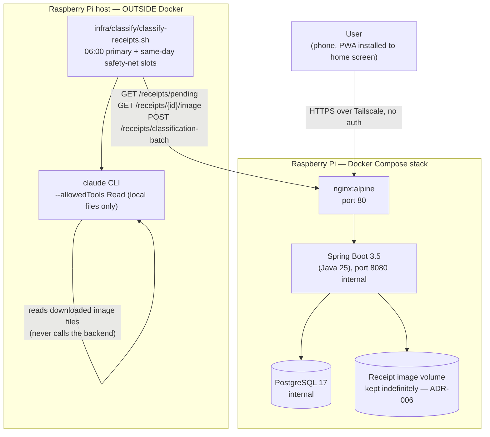

# 01 — System Context

> **Audience:** All agents. What the running system looks like, how its pieces connect, and
> what a user can actually do.

---

## What the System Is

A personal receipt-tracking web application. The user photographs a shopping receipt with their
phone (a mobile web app installed to the home screen); the photo uploads immediately; once a
day the **Claude Code CLI itself** — not an embedded Anthropic SDK call — reads every new
receipt, itemizes it, assigns each product to one of 11 fixed spending categories, and computes
totals. Purpose: see exactly how much is spent per month in each category (healthy food vs.
junk food vs. alcohol vs. the kid vs. luxuries, etc.), not just an aggregate total.

Single user, no accounts, no multi-tenant model. Runs on the same Raspberry Pi home server as
the sibling `investing-app`, reachable only over the existing Tailscale VPN — there is no
application-level authentication (ADR-004).

A second, optional receipt source exists alongside the camera: once a day, PKO Bank Polski
transactions are imported via PSD2 account-information access (ADR-007,
`docs/architecture/06-bank-integration.md`) — this closes the gap for spending that never
produces a photo (BLIK purchases, bank transfers). This is entirely off by default (no bank
connected) and design-only as of this pass — see that document for the full picture; this
document's diagram below stays focused on what's actually running today.

---

## Running Components

```
Raspberry Pi (ARM64, Docker Compose)
│
├── nginx:alpine
│   ├── Serves the React PWA static build (/)
│   └── Proxies /api/* → Spring Boot :8080
│
├── Spring Boot 3.5 (Java 25)  — port 8080 (internal only)
│   └── REST API: upload, manual entry, list/detail, classification-batch,
│       line-item correction, reprocess, spending summary/trend, categories
│
└── PostgreSQL 17  — port 5432 (internal only)
    └── Persistent volume, receipts + receipt_line_items (see 02-domain-model-and-schema.md)
    └── A second persistent volume holds uploaded receipt images (see ADR-006 — kept
        indefinitely, not just cached)

Raspberry Pi host (OUTSIDE Docker)
│
├── infra/classify/classify-receipts.sh — daily cron (06:00 Warsaw primary run, plus a few
│   same-day safety-net slots — see 04-classification-flow.md): shells out to the
│   host-installed `claude` CLI (`claude -p --allowedTools Read`) to classify every PENDING
│   receipt (both CAMERA photos and BANK_IMPORT transaction text — see
│   06-bank-integration.md) in one batched invocation, then POSTs the result back to the
│   backend over the same internal network. This is the only component in the system that
│   does not run inside Docker — same shape as investing-app's infra/news/news-research.sh.
│
└── bank-sync trigger (NOT YET BUILT — DevOps follow-up, ADR-007/06-bank-integration.md) —
    a daily cron entry calling POST /api/bank/sync, scheduled after classify-receipts.sh.
```

No outbound calls from the Spring Boot backend to any external service today — unlike
investing-app (Yahoo Finance, Binance, FRED, etc.), this app has had no market-data or
third-party integrations. The only "external" call in the running system is the host cron
script's invocation of the locally-installed `claude` CLI, which itself makes no network calls in
this app (`--allowedTools "Read"` only — it reads local image files and emits JSON; it never
calls the backend, and it does not use WebSearch/WebFetch the way investing-app's news job does).

**This changes once bank integration lands** (design-only for now, ADR-007): the backend will
make outbound HTTPS calls to PKO Bank Polski's PSD2 API from `POST /api/bank/sync` and the
consent endpoints — the first external network dependency this app has ever had. See
`06-bank-integration.md`.

---

## User Access

**No authentication anywhere** (ADR-004). The Tailscale VPN tailnet is the entire security
boundary — every endpoint in `docs/openapi.yaml` is reachable by anything on the tailnet with no
further check, including the endpoints `classify-receipts.sh` calls. If this app is ever exposed
beyond the tailnet, ADR-004 must be revisited first (see that ADR's consequences).

---

## System Context Diagram



---

## Docker Compose Topology (planned — DevOps owns the concrete file)

```
db         postgres:17-alpine (linux/arm64); volume: db-data
backend    depends_on: db (healthy); port 8080 internal; volume: receipt-images
nginx      "80:80" (tailnet-only reachability, no public exposure); depends_on: backend (healthy)
```

Two persistent volumes: the Postgres data volume, and a separate receipt-image volume mounted
into the backend container (`receipts.image_path` values are paths under this mount). Both are
durable data, not disposable cache — see ADR-006.

---

## Not Yet Built

This is a bootstrap pass — Backend, Frontend, and DevOps have not yet run against these
contracts. Nothing described as "running" above exists as code yet; this document describes the
target shape the other agents build to.
