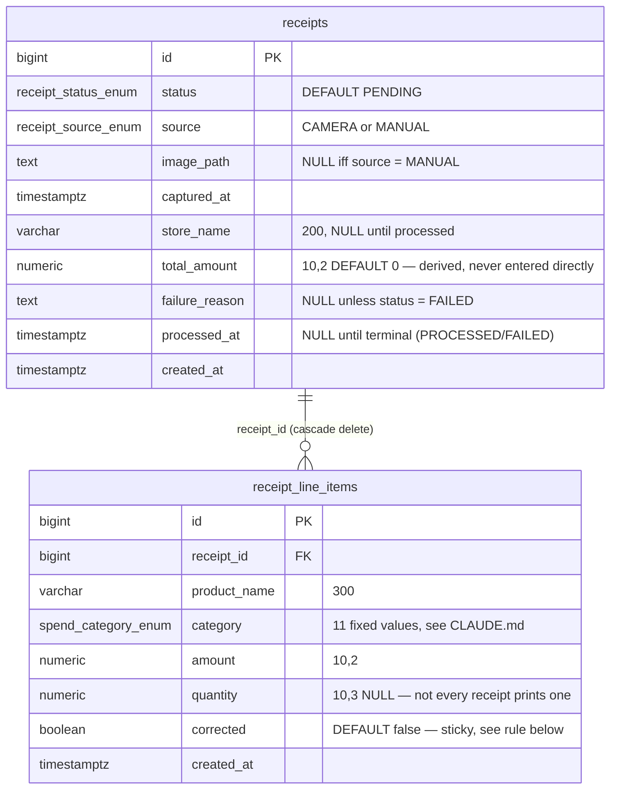

# 02 — Domain Model and Schema

> **Audience:** Backend agent (primary), all agents for reference.
> **Rules:** All schema changes go through Flyway versioned SQL (`V{n}__{description}.sql`). No
> `ddl-auto`. PKs: `BIGSERIAL`. Money: `NUMERIC(10,2)`, never `FLOAT`/`DOUBLE`. Timestamps:
> `TIMESTAMPTZ`. Canonical migration: `backend/src/main/resources/db/migration/V1__init.sql`.

---

## Domain Overview

Two tables carry the entire domain: a `receipts` header row per photographed-or-manually-entered
receipt, and a `receipt_line_items` row per product on it. Categories are a fixed 11-value
Postgres enum, not a lookup table (see ADR-005) — the canonical source of truth for what each
value means is `CLAUDE.md § Categories` at the repo root; this document only translates that
table into SQL, it does not redefine the rules.

## ER Diagram



## Enums

```sql
CREATE TYPE receipt_status_enum AS ENUM ('PENDING', 'PROCESSING', 'PROCESSED', 'FAILED');
CREATE TYPE receipt_source_enum AS ENUM ('CAMERA', 'MANUAL');
CREATE TYPE spend_category_enum AS ENUM (
    'ALKO', 'JEDZENIE_KONIECZNE', 'JEDZENIE_SREDNIE', 'JEDZENIE_PIERDOLOWATE',
    'RZECZY_PALIWO_INNE_ROZNE', 'RZECZY_LUKSUSOWE', 'MYCIE_CHEMIA',
    'ROZRYWKA_RESTAURACJE', 'RACHUNKI', 'BOBINEK', 'SUPLE'
);
```

## Critical Domain Rules

1. **`total_amount` is derived, never independently entered.** It is `SUM(receipt_line_items.amount)`
   for that receipt, recomputed in the same transaction as any line-item write — classification-
   batch insert/replace, a manual entry's initial insert, or a single-line-item correction.
2. **`corrected` line items are sticky.** If the user hand-fixes a category/amount via
   `PUT /receipts/{id}/line-items/{itemId}`, a later classification-batch replace (triggered by
   a `reprocess`) must not silently overwrite it — that replace deletes and re-inserts only the
   *uncorrected* line items for the receipt; a `corrected = true` row is never touched by it.
3. **`FAILED` vs. staying `PENDING` is a hard distinction.** There is no explicit "quota-failed"
   signal anywhere in the schema — a `claude` CLI-level failure (usage limit exhausted, or any
   other invocation error) means the wrapper script submits nothing for that run, so every
   receipt in it simply stays `PENDING` because nothing touched its row. `FAILED` is set **only**
   via `POST /receipts/classification-batch`'s `failures[]` array (a receipt Claude could read
   but genuinely couldn't parse — blurry, cut off, not a receipt) or by the backend's own
   server-side rejection of an invalid category value (see `03-receipt-lifecycle.md`) — never as
   a side effect of a script/CLI-level failure.
4. **Money is `NUMERIC(10,2)`, never `FLOAT`/`DOUBLE`**, matching CLAUDE.md's quality gate.
5. **A `CAMERA` receipt always has an `image_path`; a `MANUAL` one never does** — enforced at the
   DB level with a `CHECK` constraint, not left to application-layer discipline alone.
6. **`failure_reason` is set if and only if `status = 'FAILED'`** — also a DB-level `CHECK`, so a
   `reprocess` (which resets both together) can't accidentally leave a stale reason behind, and
   nothing else can set a reason without also setting the status.

## Indexes

- `idx_receipts_status` — serves `GET /receipts/pending` (`WHERE status = 'PENDING'`) and the
  `status` filter on `GET /receipts`.
- `idx_receipts_captured_at` — serves the `year`/`month` filters on `GET /receipts` and the
  spending summary/trend aggregate queries.
- `idx_receipt_line_items_receipt_id` — Postgres does not auto-index FK columns; needed for
  cascade-delete performance and the receipt→line-items join on every detail/list read.
- **Deliberately no index on `receipt_line_items.category`.** Spending summary/trend queries
  aggregate over a single user's receipts — low thousands of rows at the outside — so a
  sequential scan on an occasional dashboard page view is cheap. Adding one would be pure YAGNI
  overhead at this data scale.

---

## Pattern & Principle Evaluation

Per the `software-design-excellence` skill's §1 Evaluate step — recorded once here rather than
repeated per endpoint, since the same reasoning applies uniformly across this app's ~13-endpoint,
2-table surface.

| Candidate | Verdict | Why |
|---|---|---|
| Repository (Spring Data JPA) | **adopted** | Standard persistence-access seam for two aggregates; no reason to hand-roll DAOs. |
| DTO + Mapper (MapStruct) | **adopted** | CLAUDE.md quality gate: keep JPA entities out of the API layer. |
| Transaction Script (service layer) | **adopted** | Domain logic (total recompute, status transitions) is a handful of straightforward procedures, not rich cross-entity behavior — a full Domain Model layer would be ceremony this app doesn't need. |
| Idempotent Receiver (EIP) | **adopted** | `POST /receipts/classification-batch` must tolerate exact re-submission (cron retry, manual re-run) without duplicating line items — implemented as delete-uncorrected-then-insert rather than blind insert. See rule 2 above. |
| GoF State (polymorphic per-status classes) | **rejected** | 4 states, transitions triggered by exactly 3 endpoints (`classification-batch`, `reprocess`, `manual`) — a plain enum plus service-layer guard clauses covers it fully; a per-state class hierarchy is YAGNI at this size. |
| GoF Strategy (pluggable classifier) | **rejected** | There is exactly one classifier — the external headless Claude CLI — with no in-backend algorithm family to swap at runtime. |
| GoF Factory | **rejected** | Two receipt creation paths (camera upload, manual entry) differ by a handful of fields, not by construction complexity; a constructor/builder per path is enough. |
| CQRS | **rejected** | Read and write models are identical-shape DTOs over 2 tables; splitting them buys nothing at this scale. |
| Specification pattern (query filters) | **rejected** | 3 optional filters (`year`/`month`/`status`) map directly to a Spring Data JPA query method or a small JPQL query — a Specification/Criteria abstraction is overkill. |
| "Claim-and-release" on `GET /pending` (mark `PROCESSING` on fetch) | **rejected** | Considered, to guard `GET /pending` against overlapping cron runs. Rejected: CLAUDE.md's job design already serializes runs (the same-day safety-net slots are sequential, not concurrent), and the "every receipt stays `PENDING` on any failure" rule requires `GET /pending` to be a pure, non-mutating read — see `03-receipt-lifecycle.md` for where `PROCESSING` is actually used instead. |

**Money representation:** `NUMERIC(10,2)` in Postgres, `number`/`format: double` in the JSON API
(matching investing-app's own `deposits.amount` convention) — not a string-encoded decimal. A
string-encoded amount would be more precision-purist, but this app's amounts are small,
two-decimal PLN receipt totals, not the kind of high-precision multi-currency math investing-app
does; matching the sibling convention wins on consistency (YAGNI on introducing a second money
JSON convention across this author's two apps).
