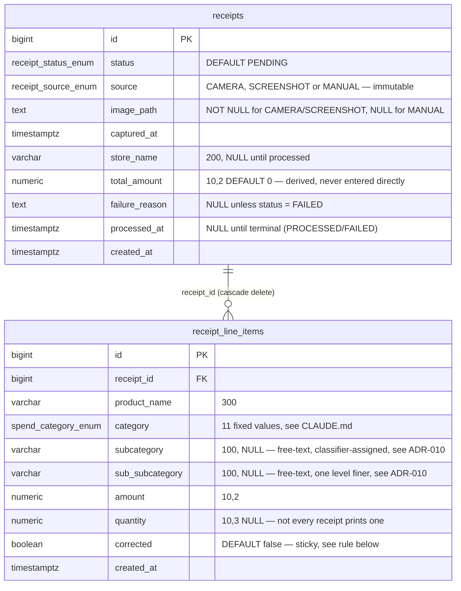
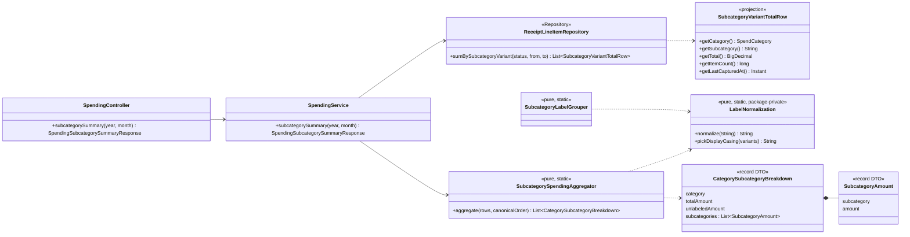
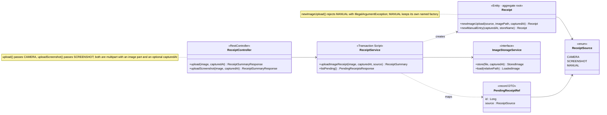

# 02 — Domain Model and Schema

> **Audience:** Backend agent (primary), all agents for reference.
> **Rules:** All schema changes go through Flyway versioned SQL (`V{n}__{description}.sql`). No
> `ddl-auto`. PKs: `BIGSERIAL`. Money: `NUMERIC(10,2)`, never `FLOAT`/`DOUBLE`. Timestamps:
> `TIMESTAMPTZ`. Canonical migrations: `backend/src/main/resources/db/migration/V1__init.sql`
> (initial schema), `V2__line_item_subcategories.sql` (adds `subcategory`/`sub_subcategory`),
> `V3__receipt_source_screenshot.sql` (adds the `SCREENSHOT` source value) and
> `V4__receipt_image_path_screenshot_check.sql` (extends the `image_path`/`source` CHECK to it).

---

## Domain Overview

Two tables carry the core domain: a `receipts` header row per photographed, screenshotted,
manually-entered, or bank-imported receipt, and a `receipt_line_items` row per
product/whole-transaction category on it. Categories are a fixed 11-value Postgres enum, not a lookup table (see ADR-005) — the
canonical source of truth for what each value means is `CLAUDE.md § Categories` at the repo root;
this document only translates that table into SQL, it does not redefine the rules.

> **Bank-import addition (design-only, ADR-007):** a third receipt source, `BANK_IMPORT`, and two
> small supporting tables (`bank_connection`, `bank_transaction_log`) are designed in
> `06-bank-integration.md` — that document owns the full reasoning; this section is updated to
> stay consistent with it but keeps the narrative brief where 06 already covers it in depth.

## ER Diagram

This is the schema as it exists after `V1`–`V4` today (two tables). `V2` is purely additive — two
nullable free-text columns on `receipt_line_items`, no new table, no new enum (see ADR-010:
`subcategory`/`sub_subcategory` are a free-text layer, deliberately not extending
`spend_category_enum`'s fixed-list approach from ADR-005). `V3`/`V4` add the `SCREENSHOT` source
value and extend the `image_path`/`source` CHECK to it (no new column, no new table — see
§ Image Upload Paths below). See `06-bank-integration.md` for the full updated ER diagram including
`BANK_IMPORT`'s two new columns and the `bank_connection`/`bank_transaction_log` tables — not
duplicated here to avoid two diagrams drifting out of sync; that document is the current one
once bank import lands.


```mermaid
erDiagram
    receipts ||--o{ receipt_line_items : "receipt_id (cascade delete)"

    receipts {
        bigint id PK
        receipt_status_enum status "DEFAULT PENDING"
        receipt_source_enum source "CAMERA, SCREENSHOT or MANUAL — immutable"
        text image_path "NOT NULL for CAMERA/SCREENSHOT, NULL for MANUAL"
        timestamptz captured_at
        varchar store_name "200, NULL until processed"
        numeric total_amount "10,2 DEFAULT 0 — derived, never entered directly"
        text failure_reason "NULL unless status = FAILED"
        timestamptz processed_at "NULL until terminal (PROCESSED/FAILED)"
        timestamptz created_at
    }
    receipt_line_items {
        bigint id PK
        bigint receipt_id FK
        varchar product_name "300"
        spend_category_enum category "11 fixed values, see CLAUDE.md"
        varchar subcategory "100, NULL — free-text, classifier-assigned, see ADR-010"
        varchar sub_subcategory "100, NULL — free-text, one level finer, see ADR-010"
        numeric amount "10,2"
        numeric quantity "10,3 NULL — not every receipt prints one"
        boolean corrected "DEFAULT false — sticky, see rule below"
        timestamptz created_at
    }
```

## Enums

```sql
CREATE TYPE receipt_status_enum AS ENUM ('PENDING', 'PROCESSING', 'PROCESSED', 'FAILED');
CREATE TYPE receipt_source_enum AS ENUM ('CAMERA', 'MANUAL');   -- V1
ALTER TYPE receipt_source_enum ADD VALUE 'SCREENSHOT';           -- V3 (own migration — see below)
CREATE TYPE spend_category_enum AS ENUM (
    'ALKO', 'JEDZENIE_KONIECZNE', 'JEDZENIE_SREDNIE', 'JEDZENIE_PIERDOLOWATE',
    'RZECZY_PALIWO_INNE_ROZNE', 'RZECZY_LUKSUSOWE', 'MYCIE_CHEMIA',
    'ROZRYWKA_RESTAURACJE', 'RACHUNKI', 'BOBINEK', 'SUPLE'
);
```

> **Design-only addition (ADR-007, not yet migrated):** `receipt_source_enum` gains a further value
> `BANK_IMPORT` (after `SCREENSHOT`; its migration must also keep `ADD VALUE` in a migration of its
> own, ahead of the one that uses it), and `receipt_status_enum` gains a fifth value `NEEDS_CATEGORY_REVIEW` (reachable
> only by `BANK_IMPORT` receipts). Full detail, new columns, and new tables in
> `06-bank-integration.md`.

## Critical Domain Rules

1. **`total_amount` is derived, never independently entered.** It is `SUM(receipt_line_items.amount)`
   for that receipt, recomputed in the same transaction as any line-item write — classification-
   batch insert/replace, a manual entry's initial insert, or a single-line-item correction.
2. **`corrected` line items are sticky.** If the user hand-fixes a category/amount via
   `PUT /receipts/{id}/line-items/{itemId}`, a later classification-batch replace (triggered by
   a `reprocess`) must not silently overwrite it — that replace deletes and re-inserts only the
   *uncorrected* line items for the receipt; a `corrected = true` row is never touched by it.
3. **`FAILED` vs. staying `PENDING` is a hard distinction.** There is no explicit "quota-failed"
   signal anywhere in the schema — a `claude` CLI-level failure (usage limit exhausted, or any
   other invocation error) means the wrapper script submits nothing for that run, so every
   receipt in it simply stays `PENDING` because nothing touched its row. `FAILED` is set **only**
   via `POST /receipts/classification-batch`'s `failures[]` array (a receipt Claude could read
   but genuinely couldn't parse — blurry, cut off, not a receipt) or by the backend's own
   server-side rejection of an invalid category value (see `03-receipt-lifecycle.md`) — never as
   a side effect of a script/CLI-level failure.
4. **Money is `NUMERIC(10,2)`, never `FLOAT`/`DOUBLE`**, matching CLAUDE.md's quality gate.
5. **A `CAMERA` or `SCREENSHOT` receipt always has an `image_path`; a `MANUAL` one never does** —
   enforced at the DB level by the `receipts_image_path_matches_source` `CHECK` constraint
   (`(source IN ('CAMERA','SCREENSHOT') AND image_path IS NOT NULL) OR (source = 'MANUAL' AND
   image_path IS NULL)`), not left to application-layer discipline alone. `source` is immutable
   after insert.
6. **`failure_reason` is set if and only if `status = 'FAILED'`** — also a DB-level `CHECK`, so a
   `reprocess` (which resets both together) can't accidentally leave a stale reason behind, and
   nothing else can set a reason without also setting the status.
7. **(Design-only, ADR-007) `NEEDS_CATEGORY_REVIEW` is reachable only by `BANK_IMPORT` receipts.**
   `CAMERA`/`SCREENSHOT`/`MANUAL` line-item classification keeps its existing "always guess, human
   corrects later" policy unchanged — this new status exists only for whole-transaction bank
   classification, where an unconfident guess must not be forced through. See
   `06-bank-integration.md`.
8. **`subcategory`/`sub_subcategory` are free-text and never validated, unlike `category`
   (ADR-010).** No enum, no `CHECK` constraint, no server-side rejection for an inconsistent or
   unusual label — Claude is only asked (in `infra/classify/prompt.md`) to reuse the same label
   for the same concept within one classification batch, which is advisory, not enforced.
   Existing rows are left `NULL` — there is no bulk-reclassification of historical receipts in
   scope, and any classification-batch/manual entry that omits these fields (e.g. an older
   prompt/script version) must not fail validation. **`corrected` does not cover these two
   fields** — a reprocess is free to overwrite them even on a line item where the user has
   hand-corrected `category`/`amount`/`productName`, since there is no edit UI for
   `subcategory`/`sub_subcategory` yet to protect in the first place.

## Indexes

- `idx_receipts_status` — serves `GET /receipts/pending` (`WHERE status = 'PENDING'`) and the
  `status` filter on `GET /receipts`.
- `idx_receipts_captured_at` — serves the `year`/`month` filters on `GET /receipts` and the
  spending summary/trend aggregate queries.
- `idx_receipt_line_items_receipt_id` — Postgres does not auto-index FK columns; needed for
  cascade-delete performance and the receipt→line-items join on every detail/list read.
- **Deliberately no index on `receipt_line_items.category`.** Spending summary/trend queries
  aggregate over a single user's receipts — low thousands of rows at the outside — so a
  sequential scan on an occasional dashboard page view is cheap. Adding one would be pure YAGNI
  overhead at this data scale.
- **Deliberately no index on `receipts.store_name` either**, for the same reason — see below.
- **Deliberately no index on `receipt_line_items.subcategory`/`sub_subcategory` either.**
  `GET /spending/line-items` (ADR-010) already scopes its query to one month + one category via
  the existing `idx_receipts_captured_at` join and a `category =` filter before it ever looks at
  these two columns — the slice being scanned is already small, so indexing free-text fields
  that exist purely for client-side grouping would be premature at this data scale. Same
  reasoning covers `GET /receipts/subcategory-labels` (see below) even though it scans **all**
  receipts rather than one month — a personal dataset's total row count is still low thousands
  at the outside, and this endpoint is called at most once per cron run, not a hot path.
  `GET /spending/subcategory-summary` (ADR-013) uses the same month-window join as
  `/spending/summary`, so it is covered by `idx_receipts_captured_at` as well.

## Store-Name Suggestions (`GET /receipts/store-names`)

Backs the manual-entry form's "Sklep / dostawca" combobox with "most used / last used"
autocomplete suggestions, drawn from `receipts.store_name` across **every** receipt — any
`status`, any `source` (`CAMERA`, `SCREENSHOT` and `MANUAL` all write this field today; `BANK_IMPORT` will
too once `06-bank-integration.md` lands — see that doc's note on `store_name` reuse). Full
endpoint contract in `docs/openapi.yaml`; ranking rationale in ADR-009. This section fixes the
exact query shape so Backend doesn't have to re-derive it.

1. **Filter:** exclude rows where `store_name IS NULL` or `trim(store_name) = ''`.
2. **Normalize for dedup:** group by `lower(trim(store_name))`.
3. **Rank groups:** `COUNT(*) DESC` (usage — the primary axis), then `MAX(captured_at) DESC`
   (recency — the tiebreak). Take the top 20 groups.
4. **Pick display casing per group:** within the group, the exact-cased `store_name` variant
   with the highest occurrence count, tie-broken by that variant's own `MAX(captured_at) DESC`.

Sketch (Postgres; Backend may implement as JPQL/native query, this is the shape, not a mandated
literal query):

```sql
WITH normalized AS (
  SELECT store_name, lower(trim(store_name)) AS norm_key, captured_at
  FROM receipts
  WHERE store_name IS NOT NULL AND trim(store_name) <> ''
),
casing_counts AS (
  SELECT norm_key, store_name, COUNT(*) AS casing_count, MAX(captured_at) AS casing_last_used
  FROM normalized
  GROUP BY norm_key, store_name
),
best_casing AS (
  SELECT DISTINCT ON (norm_key) norm_key, store_name AS display_name
  FROM casing_counts
  ORDER BY norm_key, casing_count DESC, casing_last_used DESC
),
groups AS (
  SELECT norm_key, COUNT(*) AS usage_count, MAX(captured_at) AS last_used_at
  FROM normalized
  GROUP BY norm_key
)
SELECT b.display_name
FROM groups g JOIN best_casing b USING (norm_key)
ORDER BY g.usage_count DESC, g.last_used_at DESC
LIMIT 20;
```

**No new index.** Same reasoning as skipping an index on `receipt_line_items.category`: a
personal single-user dataset stays in the low thousands of `receipts` rows, this endpoint is an
occasional autocomplete-populating call (not a hot path), and a sequential scan + in-memory
`GROUP BY` over that volume is cheap. Revisit only if the dataset's scale assumption changes.

## Known Subcategory/Sub-Subcategory Labels (`GET /receipts/subcategory-labels`)

Solves, for `subcategory`/`sub_subcategory` (ADR-010), the same cross-run drift problem
`/receipts/store-names` (ADR-009) already solves for `store_name` — except here the problem is
worse, because there's no human in the loop at all: `store_name` drift gets caught by a person
typing into a combobox that shows existing options, but `subcategory`/`sub_subcategory` are
assigned entirely by Claude, in a fresh `claude -p` process each day with zero memory of
yesterday's labels. Without this endpoint, "stay consistent" in `infra/classify/prompt.md` only
holds *within* one batch. This endpoint feeds the classifier's own prompt (not a UI, unlike
store-names) with every label it has already used, grouped by `category` since a subcategory
like "Batony" is only ever meaningful under `JEDZENIE_PIERDOLOWATE`. Full endpoint contract in
`docs/openapi.yaml`; how it gets spliced into `infra/classify/prompt.md` is specified in
`infra/classify/prompt.md` itself and ADR-010 § Cross-batch label consistency. This section
fixes the query shape.

1. **Filter:** exclude rows where `subcategory IS NULL` or `trim(subcategory) = ''`. Within a
   subcategory group, further exclude `sub_subcategory IS NULL`/blank when building its
   `subSubcategories` list (a subcategory can be known even if no `sub_subcategory` has ever
   accompanied it).
2. **Normalize for dedup, at both levels:** group by `(category, lower(trim(subcategory)))` for
   the subcategory level; within each such group, further group by
   `lower(trim(sub_subcategory))` for the sub-subcategory level. Same normalization ADR-009
   already established for `store_name` — reused here, not reinvented.
3. **Rank + pick display casing, at both levels:** within each normalized group, the exact-cased
   variant shown is the one with the highest occurrence count (tie-broken by that variant's own
   most recent `capturedAt`) — identical rule to store-names § step 4. Groups themselves —
   `subcategories` within a category, `subSubcategories` within a subcategory — are ordered by
   `COUNT(*) DESC` then `MAX(captured_at) DESC`, the same two-key ranking as store-names §
   step 3.
4. **Cap:** top 30 `subSubcategories` per subcategory group. Sized for a machine reader (the
   daily prompt manifest) rather than store-names' top-20-for-a-scanned-dropdown cap — high
   enough that it will not realistically bind at this app's personal scale, low enough to bound
   worst-case prompt growth if a subcategory's sub-subcategory vocabulary ever did sprawl. No cap
   on the number of distinct `subcategories` per category — expected to stay single-digit to low
   double-digit; if that assumption changes, that itself is a signal worth a fresh look, not
   something to silently truncate away from what the classifier gets told.
5. **Output shape:** grouped hierarchically (`category → subcategories[] → subSubcategories[]`),
   not a flat list — this is what lets `classify-receipts.sh` render it directly as a nested
   manifest (see `infra/classify/prompt.md`) without a client-side regroup. Only categories with
   at least one known subcategory appear; the 11-value set is not zero-filled (unlike
   `/spending/summary`) since a prompt manifest gains nothing from padding in empty categories.

Sketch (Postgres; captures the shape, not a mandated literal query — see note below on an
equally valid alternative):

```sql
WITH normalized AS (
  SELECT li.category, li.subcategory, lower(trim(li.subcategory)) AS sub_key,
         li.sub_subcategory, lower(trim(li.sub_subcategory)) AS subsub_key,
         r.captured_at
  FROM receipt_line_items li
  JOIN receipts r ON r.id = li.receipt_id
  WHERE li.subcategory IS NOT NULL AND trim(li.subcategory) <> ''
),
best_sub_casing AS (
  SELECT DISTINCT ON (category, sub_key) category, sub_key, subcategory AS display_subcategory
  FROM normalized
  GROUP BY category, sub_key, subcategory
  ORDER BY category, sub_key, COUNT(*) DESC, MAX(captured_at) DESC
),
sub_groups AS (
  SELECT category, sub_key, COUNT(*) AS usage_count, MAX(captured_at) AS last_used_at
  FROM normalized GROUP BY category, sub_key
),
subsub_normalized AS (
  SELECT * FROM normalized
  WHERE sub_subcategory IS NOT NULL AND trim(sub_subcategory) <> ''
),
best_subsub_casing AS (
  SELECT DISTINCT ON (category, sub_key, subsub_key) category, sub_key, subsub_key,
         sub_subcategory AS display_subsubcategory
  FROM subsub_normalized
  GROUP BY category, sub_key, subsub_key, sub_subcategory
  ORDER BY category, sub_key, subsub_key, COUNT(*) DESC, MAX(captured_at) DESC
),
subsub_groups AS (
  SELECT category, sub_key, subsub_key, COUNT(*) AS usage_count, MAX(captured_at) AS last_used_at,
         ROW_NUMBER() OVER (PARTITION BY category, sub_key
                             ORDER BY COUNT(*) DESC, MAX(captured_at) DESC) AS rn
  FROM subsub_normalized GROUP BY category, sub_key, subsub_key
)
-- assemble: sub_groups joined to best_sub_casing gives each category's subcategories,
-- subsub_groups (rn <= 30) joined to best_subsub_casing gives each subcategory's capped,
-- ranked subSubcategories — grouped in application code into the nested response shape.
```

**Given this query's two-level nesting, Backend may find it materially simpler to fetch a flat,
already-filtered `(category, subcategory, subSubcategory, capturedAt)` projection and do the
normalize/rank/cap/group steps in the service layer (e.g. Java `Collectors.groupingBy` chains)
rather than nested SQL.** At this app's data volume either approach is cheap; pick whichever is
more maintainable — the four numbered rules above are the actual contract, not the SQL sketch.

**No new index.** Same reasoning as store-names above, extended: this endpoint scans *all*
receipts (not one month), but a personal dataset's total row count stays in the low thousands,
and it is called at most once per `classify-receipts.sh` run — not a hot path.

## Subcategory Spending Breakdown (`GET /spending/subcategory-summary`)

Feeds the Wydatki dashboard's "Szczegóły" stacked bars (ADR-013). Full contract in
`docs/openapi.yaml`; this section fixes the query shape and class structure.

1. **Filter:** same as `/spending/summary` — `receipts.status = 'PROCESSED'` and
   `captured_at` in `[monthStart, nextMonthStart)` UTC.
2. **Aggregate in SQL by exact variant:** `GROUP BY li.category, li.subcategory` returning
   `(category, subcategory, SUM(amount) AS total, COUNT(*) AS itemCount,
   MAX(r.captured_at) AS lastCapturedAt)`. At personal scale this is tens of rows per month.
3. **Normalize in Java** (same rule as § Known Subcategory/Sub-Subcategory Labels step 2): rows
   whose `subcategory` is NULL or trims to `''` add to the category's `unlabeledAmount`; the rest
   merge by `lower(trim(subcategory))`, summing `total`.
4. **Display casing per group:** the exact variant with the highest `itemCount`, tie-broken by
   its `lastCapturedAt` desc, then variant string asc. Scoped to this month's rows (not global
   history) — keeps the endpoint one query; a rare month where a lower-cased variant dominates
   just displays that casing.
5. **Assemble:** all 11 categories in `CategoryCatalogService.canonicalOrder()`, zero-filled;
   `subcategories` sorted by amount desc then normalized key asc; category
   `totalAmount = unlabeledAmount + Σ amounts` (`BigDecimal`, no rounding — so it equals
   `sumByCategory`'s `SUM` exactly); top-level `totalAmount = Σ category totals`.


```mermaid
classDiagram
    direction LR
    class SpendingController {
        +subcategorySummary(year, month) SpendingSubcategorySummaryResponse
    }
    class SpendingService {
        +subcategorySummary(year, month) SpendingSubcategorySummaryResponse
    }
    class ReceiptLineItemRepository {
        <<Repository>>
        +sumBySubcategoryVariant(status, from, to) List~SubcategoryVariantTotalRow~
    }
    class SubcategoryVariantTotalRow {
        <<projection>>
        +getCategory() SpendCategory
        +getSubcategory() String
        +getTotal() BigDecimal
        +getItemCount() long
        +getLastCapturedAt() Instant
    }
    class SubcategorySpendingAggregator {
        <<pure, static>>
        +aggregate(rows, canonicalOrder) List~CategorySubcategoryBreakdown~
    }
    class LabelNormalization {
        <<pure, static, package-private>>
        +normalize(String) String
        +pickDisplayCasing(variants) String
    }
    class SubcategoryLabelGrouper {
        <<pure, static>>
    }
    class CategorySubcategoryBreakdown {
        <<record DTO>>
        category
        totalAmount
        unlabeledAmount
        subcategories : List~SubcategoryAmount~
    }
    class SubcategoryAmount {
        <<record DTO>>
        subcategory
        amount
    }
    SpendingController --> SpendingService
    SpendingService --> ReceiptLineItemRepository
    SpendingService --> SubcategorySpendingAggregator
    ReceiptLineItemRepository ..> SubcategoryVariantTotalRow
    SubcategorySpendingAggregator ..> LabelNormalization
    SubcategoryLabelGrouper ..> LabelNormalization
    SubcategorySpendingAggregator ..> CategorySubcategoryBreakdown
    CategorySubcategoryBreakdown *-- SubcategoryAmount
```

**Legend / patterns applied:**
- **Repository + projection** (existing seam) — one new aggregate query on
  `ReceiptLineItemRepository`, same style as `sumByCategory`.
- **Transaction Script** — `SpendingService.subcategorySummary` computes the month window exactly
  as `summary()` does (extract that inline UTC-window computation into a private helper both
  call, rather than copying it) and delegates the pure
  merging to the aggregator.
- **SRP + DRY** — `SubcategorySpendingAggregator` is a new dependency-free class (unit-testable
  without Testcontainers, same rationale as `SubcategoryLabelGrouper`) because *summing amounts*
  is a different responsibility from *ranking labels by usage*. The one thing they genuinely
  share — `normalize()` and "most-used casing, tie by recency" — is extracted from
  `SubcategoryLabelGrouper`'s private methods into a small package-private `LabelNormalization`
  helper that both call, so the ADR-010 §5 rule lives in exactly one place.
- **DTOs** are plain Java records mirroring the OpenAPI schemas (`SubcategoryAmount`,
  `CategorySubcategoryBreakdown`, `SpendingSubcategorySummaryData`,
  `SpendingSubcategorySummaryResponse`) in `pl.receipts.dto.spending`; no entity crosses the API.
- **Rejected:** a generic "group-by-any-label" framework, Strategy for bucketing, or doing top-N
  in the service — see ADR-013.

**No new index** — same month-window join as `/spending/summary`, same data scale.

---

## Image Upload Paths (`CAMERA` / `SCREENSHOT`)

Two endpoints create an image-backed, `PENDING` receipt — `POST /receipts` (a photographed paper
receipt, `source = CAMERA`) and `POST /receipts/screenshot` (a pasted/picked screenshot of a digital
receipt, `source = SCREENSHOT`). Everything downstream of creation — the pending list, the image
download, `classification-batch`, correction, reprocess, delete, the dashboard — is
source-agnostic; the only places `source` is read are the pending list (so the script can tag the
image for the classifier, see `04-classification-flow.md`) and the frontend's fallback title.


```mermaid
classDiagram
    direction LR
    class ReceiptController {
        <<RestController>>
        +upload(image, capturedAt) ReceiptSummaryResponse
        +uploadScreenshot(image, capturedAt) ReceiptSummaryResponse
    }
    class ReceiptService {
        <<Transaction Script>>
        +uploadImageReceipt(image, capturedAt, source) ReceiptSummary
        +listPending() PendingReceiptsResponse
    }
    class Receipt {
        <<Entity - aggregate root>>
        +newImageUpload(source, imagePath, capturedAt) Receipt
        +newManualEntry(capturedAt, storeName) Receipt
    }
    class ReceiptSource {
        <<enum>>
        CAMERA
        SCREENSHOT
        MANUAL
    }
    class ImageStorageService {
        <<interface>>
        +store(file, capturedAt) StoredImage
        +load(relativePath) LoadedImage
    }
    class PendingReceiptRef {
        <<record DTO>>
        id : Long
        source : ReceiptSource
    }
    ReceiptController --> ReceiptService
    ReceiptService --> ImageStorageService
    ReceiptService ..> Receipt : creates
    Receipt --> ReceiptSource
    ReceiptService ..> PendingReceiptRef : maps
    PendingReceiptRef --> ReceiptSource
    note for ReceiptController "upload() passes CAMERA, uploadScreenshot() passes SCREENSHOT; both are multipart with an image part and an optional capturedAt"
    note for Receipt "newImageUpload() rejects MANUAL with IllegalArgumentException; MANUAL keeps its own named factory"
```

**Legend / patterns applied:**
- **Transaction Script (existing)** — `ReceiptService.uploadImageReceipt(image, capturedAt, source)`
  replaces `uploadCameraReceipt`: it stores the image, builds the receipt with the given source and
  saves it, defaulting `capturedAt` to now. One method for both paths (**DRY**); the controller
  decides the source, so a client can never choose one.
- **Named static factory (existing `Receipt` idiom)** — `Receipt.newImageUpload(source, …)` replaces
  `newCameraUpload` and accepts `CAMERA` or `SCREENSHOT` only. `newManualEntry` stays separate
  because it differs in status, processing time and image.
- **Controller stays thin (SRP)** — two `@PostMapping` methods that differ only in the
  `ReceiptSource` constant passed to the service; the image allow-list, size limit and
  `UnsupportedImageTypeException` handling already live in `FilesystemImageStorageService` and
  `GlobalExceptionHandler` and are reused unchanged.
- **Mapping** — `PendingReceiptRef` gains `source` (the OpenAPI schema already required it);
  `ReceiptMapper`'s `source` mapping on `ReceiptSummary`/`ReceiptDetail` needs no change.
- **Rejected:** a Strategy/handler per source, a `source` form field on `POST /receipts`, and a
  second column for "capture kind" — see ADR-014 and the table below.

**Migration shape (why two files).** `ALTER TYPE … ADD VALUE` may run inside a transaction, but the
new value cannot be *used* (e.g. in a CHECK) until that transaction commits. Flyway runs each
versioned migration in its own transaction, so `V3` contains only the `ADD VALUE` and `V4` the
re-created `receipts_image_path_matches_source` constraint. `spring.flyway.group` must stay `false`.
`V1`/`V2` are never edited (recorded checksums). The existing `Receipt.source` mapping
(`@Enumerated(STRING)` + `@JdbcTypeCode(NAMED_ENUM)`) works with the new value as long as the Java
`ReceiptSource` enum gains `SCREENSHOT`.

---

## Pattern & Principle Evaluation

Per the `software-design-excellence` skill's §1 Evaluate step — recorded once here rather than
repeated per endpoint, since the same reasoning applies uniformly across this app's ~14-endpoint,
2-table surface.

| Candidate | Verdict | Why |
|---|---|---|
| Repository (Spring Data JPA) | **adopted** | Standard persistence-access seam for two aggregates; no reason to hand-roll DAOs. |
| DTO + Mapper (MapStruct) | **adopted** | CLAUDE.md quality gate: keep JPA entities out of the API layer. |
| Transaction Script (service layer) | **adopted** | Domain logic (total recompute, status transitions) is a handful of straightforward procedures, not rich cross-entity behavior — a full Domain Model layer would be ceremony this app doesn't need. |
| Idempotent Receiver (EIP) | **adopted** | `POST /receipts/classification-batch` must tolerate exact re-submission (cron retry, manual re-run) without duplicating line items — implemented as delete-uncorrected-then-insert rather than blind insert. See rule 2 above. |
| GoF State (polymorphic per-status classes) | **rejected** | 4 states, transitions triggered by exactly 3 endpoints (`classification-batch`, `reprocess`, `manual`) — a plain enum plus service-layer guard clauses covers it fully; a per-state class hierarchy is YAGNI at this size. |
| GoF Strategy (pluggable classifier) | **rejected** | There is exactly one classifier — the external headless Claude CLI — with no in-backend algorithm family to swap at runtime. |
| GoF Factory | **rejected** | Two receipt creation paths (camera upload, manual entry) differ by a handful of fields, not by construction complexity; a constructor/builder per path is enough. |
| CQRS | **rejected** | Read and write models are identical-shape DTOs over 2 tables; splitting them buys nothing at this scale. |
| Specification pattern (query filters) | **rejected** | 3 optional filters (`year`/`month`/`status`) map directly to a Spring Data JPA query method or a small JPQL query — a Specification/Criteria abstraction is overkill. |
| Materialized view / cache for `GET /receipts/store-names` | **rejected** | Considered, since it's a GROUP BY/aggregate query. Rejected: low-thousands-row table, called only when the manual-entry form opens (not a hot path) — a live aggregate query is cheap enough that a cache/materialized view would be YAGNI, and would add a staleness problem (a store name used seconds ago should be suggestible immediately) for no real benefit. |
| "Claim-and-release" on `GET /pending` (mark `PROCESSING` on fetch) | **rejected** | Considered, to guard `GET /pending` against overlapping cron runs. Rejected: CLAUDE.md's job design already serializes runs (the same-day safety-net slots are sequential, not concurrent), and the "every receipt stays `PENDING` on any failure" rule requires `GET /pending` to be a pure, non-mutating read — see `03-receipt-lifecycle.md` for where `PROCESSING` is actually used instead. |
| Free-text `subcategory`/`sub_subcategory` columns vs. a second enum/lookup table (ADR-010) | **adopted (free-text)** | Unlike `spend_category_enum`'s closed 11-value list (ADR-005), these are classifier-generated groupings with no user-given closed list — a fixed enum can't be extended without a migration every time a new grouping emerges, which defeats the point; a lookup table would need the same CRUD machinery ADR-005 already rejected for the main category. Plain nullable `VARCHAR` columns, YAGNI-appropriate for advisory, non-validated data. |
| `GET /spending/line-items` as a new endpoint vs. a nested breakdown on `GET /spending/summary` (ADR-010) | **adopted (new endpoint)** | The summary endpoint loads eagerly on every dashboard visit and must stay a cheap 11-row aggregate; a category's line items are only ever needed lazily, on click, for one category+month at a time — a dedicated endpoint keeps the eager path unchanged and fetches drill-down data only when actually requested. |
| `GET /receipts/subcategory-labels` as a new endpoint vs. extending `/receipts/store-names` to return arbitrary "known values of field X" (ADR-010 refinement) | **adopted (new endpoint)** | Reuses store-names' *shape* (ranked, deduplicated, capped, unpaginated) but not its *route* — the response needed is a category-scoped hierarchy (`category → subcategory → subSubcategory[]`), not a flat string list, so a generic single endpoint would need a discriminated-union response purely to save a route, for two consumers (PWA combobox vs. the prompt-builder script) that will never share a call site. Same reasoning class as the `GET /spending/line-items`-vs-nested-field call directly above: different shape/consumer wins over route reuse. |
| `GET /spending/subcategory-summary` as a new aggregate endpoint vs. 11× `/spending/line-items` or a nested field on `/spending/summary` (ADR-013) | **adopted (new endpoint)** | One small aggregate call for one chart; keeps `/spending/summary` (eager) unchanged and avoids shipping every line item of the month to draw bar segments. Fetched lazily only in "Szczegóły" mode. |
| Server-side top-N + "Reszta" bucketing (ADR-013) | **rejected** | N is a presentation choice (bar width, legibility); the client needs the full list anyway for the accessible table fallback, and bucketing ≤ ~13 entries per bar is trivial. Server returns full sorted sums. |
| Extract shared `LabelNormalization` helper from `SubcategoryLabelGrouper` | **adopted** | DRY with exactly two real consumers of the ADR-010 §5 normalize/casing rule — not speculative. Separate aggregator class keeps SRP (summing ≠ ranking). |
| New `SCREENSHOT` source value vs. reusing `CAMERA` (ADR-014) | **adopted (new value)** | The origin must reach the classifier prompt and the UI label, and cannot be recovered retroactively once screenshot and photo rows are mixed. `source` already means "origin", so one enum value + one CHECK extension beats a second "capture kind" column or a file-type heuristic. |
| `POST /receipts/screenshot` vs. a `source` form field on `POST /receipts` (ADR-014) | **adopted (new endpoint)** | Leaves the camera contract untouched, mirrors `/receipts/manual` (one path per origin), and means no client-supplied enum to validate. |
| Strategy / per-source upload handler classes | **rejected** | The two uploads differ by one enum constant; `uploadImageReceipt(…, source)` covers both. YAGNI. |

**Bank-import additions (design-only, ADR-007):** Ports & Adapters for the PSD2 client, and
several more pattern calls specific to that integration (a rejected three-way match state
machine, a rejected `@Scheduled` timer, etc.) — see the dedicated table in
`06-bank-integration.md` rather than duplicating it here.

**Money representation:** `NUMERIC(10,2)` in Postgres, `number`/`format: double` in the JSON API
(matching investing-app's own `deposits.amount` convention) — not a string-encoded decimal. A
string-encoded amount would be more precision-purist, but this app's amounts are small,
two-decimal PLN receipt totals, not the kind of high-precision multi-currency math investing-app
does; matching the sibling convention wins on consistency (YAGNI on introducing a second money
JSON convention across this author's two apps).
