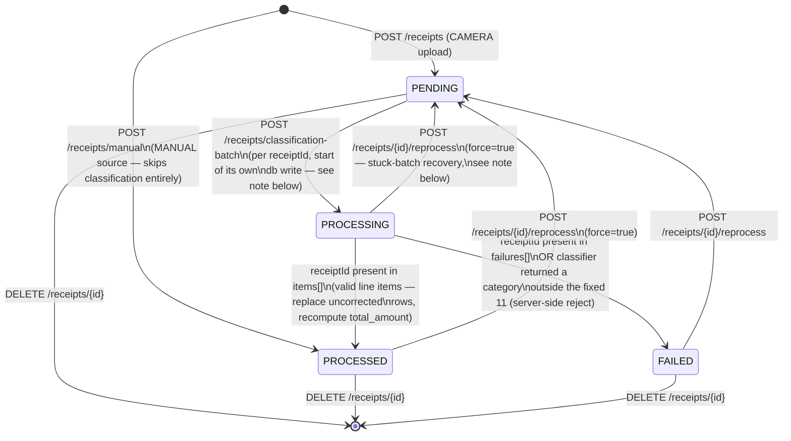

# 03 — Receipt Status Lifecycle

> **Audience:** Backend agent (primary), Frontend agent (for status-dependent UI).

---

## State Diagram

## What Each Transition Means

| Transition | Trigger | Notes |
|---|---|---|
| `[*] → PENDING` | `POST /receipts` (camera upload) | Returns immediately; no classification on this request. |
| `[*] → PROCESSED` | `POST /receipts/manual` | Skips `PENDING`/`PROCESSING` entirely — no photo, nothing to classify. Line items are given directly by the user. |
| `PENDING → PROCESSING → PROCESSED` | `POST /receipts/classification-batch`, one `items[]` entry | Both transitions happen inside the same backend transaction for that receipt — replace its uncorrected line items, recompute `total_amount`, stamp `processed_at`. |
| `PENDING → PROCESSING → FAILED` | `POST /receipts/classification-batch`, one `failures[]` entry, **or** an `items[]` entry whose `category` doesn't match the fixed 11-value enum | The second case is a backend-side safety net, not something the prompt asks Claude to do — see `04-classification-flow.md` and CLAUDE.md's gate: *"Claude must never invent a category outside the fixed 11 — validate its output against the enum and flag (don't silently coerce) any mismatch."* Flagging = routing that receipt to `FAILED` with an explanatory `failureReason`, exactly as if Claude had reported it as unreadable. |
| `FAILED → PENDING` | `POST /receipts/{id}/reprocess` | No `force` needed — re-queuing a known failure is always allowed. |
| `PROCESSED → PENDING` | `POST /receipts/{id}/reprocess` with `force: true` | Requires the explicit flag — a normal reprocess must not accidentally discard a good result. |
| `PROCESSING → PENDING` | `POST /receipts/{id}/reprocess` with `force: true` | Recovery path for a receipt left stuck mid-batch by a backend crash (process killed/OOM between the two DB writes) — see "Why `PROCESSING` exists" below. Not the quota-exhaustion case; that never reaches `PROCESSING` at all. |
| `{PENDING, PROCESSED, FAILED} → [*]` | `DELETE /receipts/{id}` | Removes the row (line items cascade) and the image file. `PROCESSING` is not a valid delete-from state in the contract — by the time a delete request could reach the backend, any given receipt's batch transaction has already resolved one way or the other in the overwhelming common case; a genuinely stuck `PROCESSING` row should be `reprocess`d (forced) back to `PENDING` first. |

## Why `GET /receipts/pending` Never Appears on This Diagram

It's a pure read — **it never changes status.** This is not an oversight; it's required by
CLAUDE.md's retry design: *"If the claude invocation fails... every receipt in that run simply
stays PENDING (nothing marked it otherwise)."* If fetching the pending list moved receipts into
`PROCESSING`, a failed `claude` invocation downstream would leave them stuck there with no
generic recovery (the script has no "unclaim" call, deliberately — see
`04-classification-flow.md`'s retry sequence). Keeping the fetch non-mutating means the *only*
way into `PROCESSING` is a `classification-batch` submission that's actually about to resolve
each receipt one way or the other in the same request.

## Why `PROCESSING` Exists At All

Given the fetch is non-mutating and the batch endpoint resolves each receipt to a terminal state
in the same request, `PROCESSING` is a genuinely transient, per-item state within
`POST /receipts/classification-batch`'s own handling — not a long-lived "in flight" marker. It
still earns its place in the schema for two reasons:

1. **Per-item isolation.** CLAUDE.md's quality gate requires the batch endpoint to *"never crash
   the whole batch over one bad receipt — continue processing the rest of the queue."* That means
   each receipt's write is its own unit of work, not one giant all-or-nothing transaction —
   which is exactly the shape where a state briefly held per-item, immediately before its
   terminal write, is meaningful (and where a mid-batch backend crash could plausibly leave one
   receipt stuck there while its siblings already completed).
2. **Explicit, forced recovery path.** Because that stuck-`PROCESSING` case is possible (if rare —
   a backend crash, not a `claude`/quota failure), `reprocess` explicitly covers it (`force: true`
   resets `PROCESSING → PENDING`, same as `PROCESSED`) rather than leaving it as a dead end only
   fixable by hand in the database.

## Manual Correction Doesn't Move Status

`PUT /receipts/{id}/line-items/{itemId}` never changes `receipts.status` — it only ever touches
the target line item (`corrected = true`, new values) and recomputes `total_amount`. A `PROCESSED`
receipt with a hand-corrected line item stays `PROCESSED`; there is no "partially reviewed" state.
