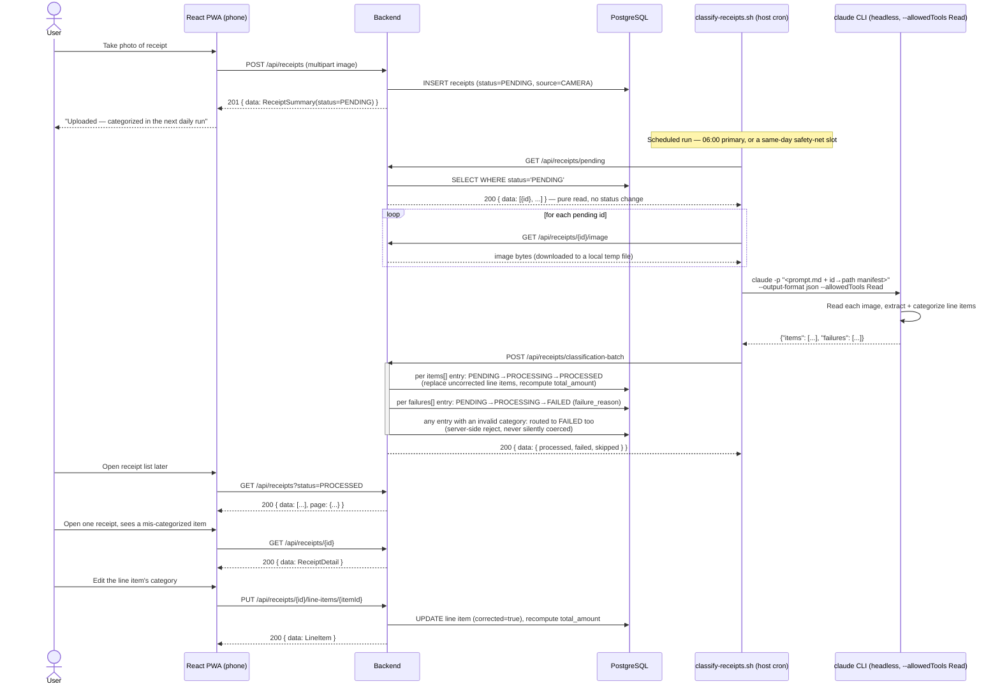
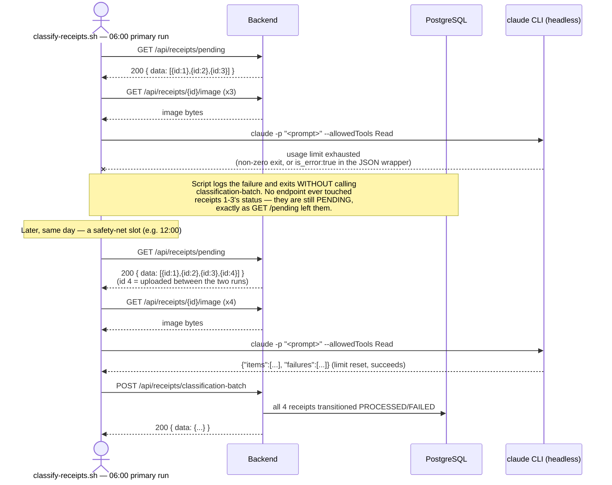

# 04 — Capture → Upload → Classify → Correct Flow

> **Audience:** All agents — this is the whole point of the app end to end.
>
> **Design-only addition (ADR-007):** the daily classification batch below is shown for the
> original `CAMERA`-only shape and remains accurate for it unchanged. Once bank import lands, the
> same batch also carries `BANK_IMPORT` ids (inline transaction text instead of an image
> download) and Claude's reply gains a third, `uncertainCategory[]` outcome — see
> `06-bank-integration.md`'s "Classification: Whole-Transaction, No Image" section for that
> extension; it is not duplicated into the diagrams below.

---

## Happy Path: Capture Through Correction

Key contract points visible in this flow:
- Upload never blocks on classification — `POST /receipts` returns as soon as the file is
  stored, always `PENDING`, no model call on the request path.
- `GET /receipts/pending` is a pure read (see `03-receipt-lifecycle.md` for why this matters).
- Exactly **one** `claude -p` invocation per cron run, covering the whole batch — not one per
  receipt (ADR-002's cost/usage-limit rationale).
- Claude never calls the backend. Every HTTP call in this diagram to/from `Backend` originates
  from either the PWA or the wrapper script — `--allowedTools "Read"` gives Claude nothing else.
- A correction (`PUT .../line-items/{itemId}`) never re-invokes the classifier and never changes
  `receipts.status` — it's a pure data edit plus a `total_amount` recompute.

---

## Retry on Usage-Limit Exhaustion

Why this is safe with **no special-cased quota detection**: the script's failure handling is
uniform for *any* `claude` invocation failure, not specifically a quota error (CLAUDE.md is
explicit about this). Because `GET /pending` never mutates state and the script only ever writes
to the backend via one call — `classification-batch`, made strictly after a successful `claude`
run — there is no intermediate state to unwind on failure. The next scheduled slot's
`GET /pending` naturally re-includes every receipt from the failed run, plus anything uploaded
since, with zero bookkeeping required in the script itself.

The primary run is at 06:00 rather than overnight because losing a whole day of classification
is higher-stakes for this app's core purpose than investing-app's nightly news job losing one
night — hence the extra same-day safety-net slots, each a cheap no-op unless the primary run
actually failed (an empty `GET /pending` response makes the script exit immediately, per
CLAUDE.md § Daily classification job step 1 — no `claude` invocation spent on an empty queue).
