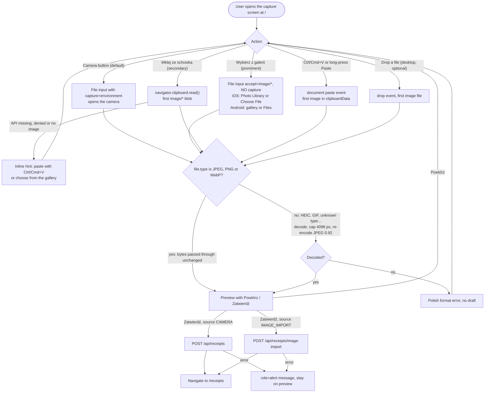
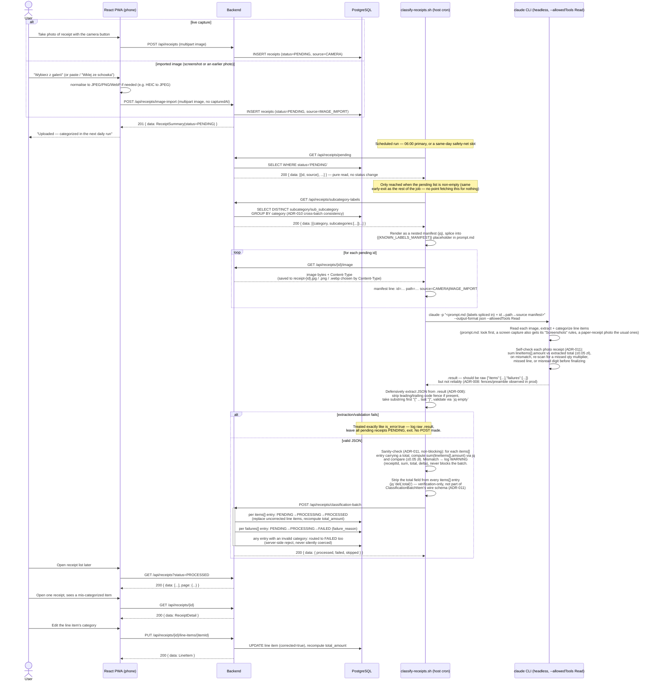
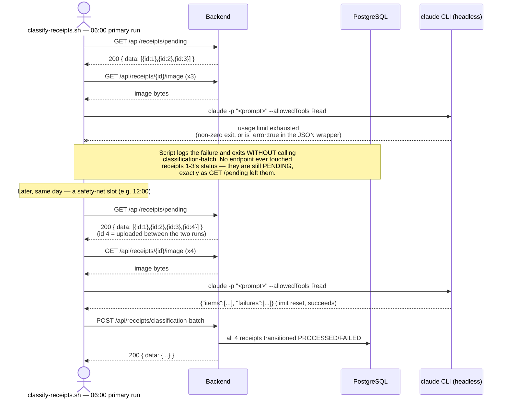

# 04 — Capture → Upload → Classify → Correct Flow

> **Audience:** All agents — this is the whole point of the app end to end.
>
> **Image sources:** a pending receipt is an image that either was captured live by the camera
> input (`CAMERA`) or was **imported** from the phone gallery, file picker or clipboard
> (`IMAGE_IMPORT`, ADR-014) — a screenshot of a digital receipt, or an earlier photo of a paper
> one. They share every step of the flow below; the only differences are the PWA entry point and
> upload endpoint (see "Capture Entry Points"), the `source=` hint on the image's manifest line,
> and the classifier's "Screenshots and imported images" rules, which tell it to look at the image
> and apply the screenshot guidance only to an actual screen capture (`infra/classify/prompt.md`).
>
> **Design-only addition (ADR-007):** the daily classification batch below is shown for the
> image-only shape (`CAMERA`/`IMAGE_IMPORT`) and remains accurate for it unchanged. Once bank import lands, the
> same batch also carries `BANK_IMPORT` ids (inline transaction text instead of an image
> download) and Claude's reply gains a third, `uncertainCategory[]` outcome — see
> `06-bank-integration.md`'s "Classification: Whole-Transaction, No Image" section for that
> extension; it is not duplicated into the diagrams below.

---

## Capture Entry Points (PWA)

The capture screen (`/`, `CaptureRoute`) is the only place an image enters the system. The app is
used almost entirely on a phone (iPhone Safari PWA, Android Chrome PWA), so **importing from the
gallery is a first-class path, one tap from the home screen**, next to the camera; pasting is
secondary, and desktop paste / drag-and-drop is a nice-to-have. There is no new route, no tab or
mode switch, and no new bottom-nav item (the nav is a full 4-column grid). Every entry point
converges on **one** normalisation step, **one** preview → "Powtórz" / "Zatwierdź" confirm step and
one upload mutation; only the upload endpoint differs.

```mermaid
flowchart TD
    Start(["User opens the capture screen at /"]) --> Act{"Action"}
    Act -->|"Camera button (default)"| Cam["File input with capture=environment<br/>opens the camera"]
    Act -->|"Wybierz z galerii (prominent)"| Pick["File input accept=image/*, NO capture<br/>iOS: Photo Library or Choose File<br/>Android: gallery or Files"]
    Act -->|"Wklej ze schowka (secondary)"| Clip["navigator.clipboard.read()<br/>first image/* blob"]
    Act -->|"Ctrl/Cmd+V or long-press Paste"| Paste["document paste event<br/>first image in clipboardData"]
    Act -->|"Drop a file (desktop, optional)"| Drop["drop event, first image file"]
    Clip -->|"API missing, denied or no image"| Hint["Inline hint: paste with Ctrl/Cmd+V<br/>or choose from the gallery"]
    Hint --> Act
    Cam --> Norm{"file.type is JPEG, PNG or WebP?"}
    Pick --> Norm
    Clip --> Norm
    Paste --> Norm
    Drop --> Norm
    Norm -->|"yes: bytes passed through unchanged"| Prev["Preview with Powtórz / Zatwierdź"]
    Norm -->|"no: HEIC, GIF, unknown type...<br/>decode, cap 4096 px, re-encode JPEG 0.92"| Dec{"Decoded?"}
    Dec -->|"yes"| Prev
    Dec -->|"no"| Fmt["Polish format error, no draft"]
    Fmt --> Act
    Prev -->|"Powtórz"| Act
    Prev -->|"Zatwierdź, source CAMERA"| PostCam["POST /api/receipts"]
    Prev -->|"Zatwierdź, source IMAGE_IMPORT"| PostImp["POST /api/receipts/image-import"]
    PostCam --> Done["Navigate to /receipts"]
    PostImp --> Done
    PostCam -->|"error"| Err["role=alert message, stay on preview"]
    PostImp -->|"error"| Err
```

**Legend / decisions applied (frontend structure — implement exactly this):**
- **Layout of the capture screen (no draft showing), top to bottom:** the existing big round camera
  button (unchanged, still the default home action) → a **full-width "Wybierz z galerii" button**
  (`variant="outline"`, `size="lg"`, touch target ≥ 48 px, an `ImagePlus`/`Images` icon) directly
  beneath it → a smaller secondary **"Wklej ze schowka"** button (`variant="ghost"`, `size="sm"`,
  `ClipboardPaste` icon), rendered **only if** `typeof navigator.clipboard?.read === "function"`
  (the app may be served over plain HTTP on the tailnet, where the async Clipboard API does not
  exist) → a muted hint "Na komputerze możesz też wkleić obraz skrótem Ctrl/Cmd+V.", shown only
  when `matchMedia("(pointer: fine)")` matches. The page title becomes **"Dodaj paragon"**; the
  helper text mentions both the camera and the gallery.
- **Two hidden file inputs.** Camera: `accept="image/*" capture="environment"` (unchanged).
  Gallery: **`accept="image/*"` and no `capture` attribute** — `image/*`, not a
  `png,jpeg,webp` list, because on iOS it yields the Photo Library / Choose File sheet (library
  photos arrive already transcoded to JPEG) and on Android it opens the system gallery/photo
  picker **and shows HEIC/HEIF files**, which a restrictive list would hide or route to the
  generic Files UI. No `multiple`: one image is one receipt entry (multi-select is a follow-up).
  Reset `input.value` after each selection so the same file can be picked again.
- **One normalisation step for every path** (camera, gallery, clipboard button, `paste` event,
  drop) — a pure, unit-testable helper (e.g. `normalizeImageFile(file): Promise<File>`): if
  `file.type` is `image/jpeg`, `image/png` or `image/webp`, return it **unchanged** (no
  recompression, original bytes). Otherwise (HEIC/HEIF, GIF, BMP, AVIF, empty/unknown type) decode
  with `createImageBitmap(file)` (EXIF orientation applied), scale so the longer side is ≤ 4096 px,
  paint onto a canvas over a **white** background, and `toBlob("image/jpeg", 0.92)`; return it as a
  `File` named `<basename>.jpg` with type `image/jpeg`. If decoding or encoding fails, throw a typed
  error and show the Polish message **"Nie udało się odczytać tego formatu obrazu (np. HEIC).
  Wybierz zdjęcie JPEG/PNG lub zrób zrzut ekranu."** — no draft is created. After normalisation, a
  file over **20 MB** is rejected client-side with "Plik jest za duży (maks. 20 MB)." A `422` from
  either upload endpoint is mapped to the format message as a last-resort guard.
- **A draft carries its source.** `CaptureRoute` holds one draft `{ file, source: "CAMERA" |
  "IMAGE_IMPORT" }` plus its object URL (revoked on discard, as today). The camera path creates a
  `CAMERA` draft; gallery, clipboard, paste and drop create an `IMAGE_IMPORT` draft. The confirm step
  and error handling are the existing ones (`CapturePreview`, `role="alert"`); `CapturePreview`'s
  `alt` becomes neutral ("Podgląd obrazu paragonu"). On success navigate to `/receipts`.
- **Paste.** A `paste` listener on `document` is registered while no draft is showing; it takes the
  first image in `clipboardData.files`/`items`, calls `preventDefault()`, and runs it through the
  normalisation step. It is the primary path on desktop and wherever long-press → Paste fires on
  mobile. Text-only pastes are ignored.
- **"Wklej ze schowka" button** uses `navigator.clipboard.read()` and takes the first item type
  starting with `image/`. On permission denied or no image on the clipboard, show an inline,
  non-blocking message ("W schowku nie ma obrazu." / hint to use the gallery) — never a dead end.
- **Pasted blobs get a name and their real MIME type.** A pasted/clipboard blob has no filename: build
  `new File([blob], "import-<yyyyMMdd-HHmmss>.<png|jpg|webp>", { type: blob.type })` before
  normalising. The server reads only the part's content type, never the filename.
- **Drag-and-drop** onto the screen on desktop is optional; if built, it feeds the same path.
- **Upload.** `useUploadReceipt` takes `{ image, capturedAt?, source }` and calls `POST /receipts`
  (CAMERA; sends `capturedAt` as today) or `POST /receipts/image-import` (IMAGE_IMPORT; **omits
  `capturedAt`** — the server defaults it to now and the classifier later overrides the date with the
  one printed/shown on the image). Same query invalidation as today.
- **Labels.** One small helper (e.g. `fallbackReceiptTitle(source)`) replaces the duplicated ternary
  in `ReceiptCard` and `ReceiptDetailRoute`: `IMAGE_IMPORT → "Zaimportowany obraz"`,
  `MANUAL → "Wpis ręczny"`, otherwise `"Paragon"`. The detail screen's title/`alt` also use it.
  `ReceiptSource` in `lib/types.ts` gains `"IMAGE_IMPORT"`. The dashboard drill-down row
  (`CategoryLineItemRow`) keeps its `"Paragon"` fallback: `SpendingLineItem` has no `source`, and
  adding one is out of scope.
- **Rejected:** a segmented control / tabs (it would hide the primary phone path behind a second
  tap), a `/import` route and a fifth bottom-nav item (ADR-014). **Not in scope:** multi-select,
  stitched long screenshots, Web Share Target, server-side HEIC conversion (ADR-014 follow-ups).

---

## Happy Path: Capture Through Correction

```mermaid
sequenceDiagram
    actor User
    participant PWA as React PWA (phone)
    participant Backend
    participant DB as PostgreSQL
    participant Cron as classify-receipts.sh (host cron)
    participant Claude as claude CLI (headless, --allowedTools Read)

    alt live capture
        User->>PWA: Take photo of receipt with the camera button
        PWA->>Backend: POST /api/receipts (multipart image)
        Backend->>DB: INSERT receipts (status=PENDING, source=CAMERA)
    else imported image (screenshot or an earlier photo)
        User->>PWA: "Wybierz z galerii" (or paste / "Wklej ze schowka")
        PWA->>PWA: normalise to JPEG/PNG/WebP if needed (e.g. HEIC to JPEG)
        PWA->>Backend: POST /api/receipts/image-import (multipart image, no capturedAt)
        Backend->>DB: INSERT receipts (status=PENDING, source=IMAGE_IMPORT)
    end
    Backend-->>PWA: 201 { data: ReceiptSummary(status=PENDING) }
    PWA-->>User: "Uploaded — categorized in the next daily run"

    Note over Cron: Scheduled run — 06:00 primary, or a same-day safety-net slot
    Cron->>Backend: GET /api/receipts/pending
    Backend->>DB: SELECT WHERE status='PENDING'
    Backend-->>Cron: 200 { data: [{id, source}, ...] } — pure read, no status change

    Note over Cron: Only reached when the pending list is non-empty (same<br/>early-exit as the rest of the job — no point fetching this for nothing)
    Cron->>Backend: GET /api/receipts/subcategory-labels
    Backend->>DB: SELECT DISTINCT subcategory/sub_subcategory<br/>GROUP BY category (ADR-010 cross-batch consistency)
    Backend-->>Cron: 200 { data: [{category, subcategories:[...]}...] }
    Cron->>Cron: Render as a nested manifest (jq), splice into<br/>{{KNOWN_LABELS_MANIFEST}} placeholder in prompt.md

    loop for each pending id
        Cron->>Backend: GET /api/receipts/{id}/image
        Backend-->>Cron: image bytes + Content-Type<br/>(saved to receipt-{id}.jpg / .png / .webp chosen by Content-Type)
        Cron->>Cron: manifest line: id=… path=… source=CAMERA|IMAGE_IMPORT
    end

    Cron->>Claude: claude -p "<prompt.md (labels spliced in) + id→path→source manifest>"<br/>--output-format json --allowedTools Read
    Claude->>Claude: Read each image, extract + categorize line items<br/>(prompt.md: look first, a screen capture also gets its "Screenshots" rules, a paper-receipt photo the usual ones)
    Claude->>Claude: Self-check each photo receipt (ADR-011):<br/>sum lineItems[].amount vs extracted total (±0.05 zł),<br/>on mismatch, re-scan for a missed qty multiplier,<br/>missed line, or misread digit before finalizing
    Claude-->>Cron: .result — should be raw {"items":[...],"failures":[...]}<br/>but not reliably (ADR-008: fences/preamble observed in prod)

    Cron->>Cron: Defensively extract JSON from .result (ADR-008):<br/>strip leading/trailing code fence if present,<br/>take substring first "{" .. last "}", validate via `jq empty`
    alt extraction/validation fails
        Note over Cron,DB: Treated exactly like is_error:true — log raw .result,<br/>leave all pending receipts PENDING, exit. No POST made.
    else valid JSON
        Cron->>Cron: Sanity-check (ADR-011, non-blocking): for each items[]<br/>entry carrying a total, compute sum(lineItems[].amount) via jq<br/>and compare (±0.05 zł). Mismatch → log WARNING<br/>(receiptId, sum, total, delta), never blocks the batch.
        Cron->>Cron: Strip the total field from every items[] entry<br/>(jq 'del(.total)') — verification-only, not part of<br/>ClassificationBatchItem's wire schema (ADR-011)
        Cron->>Backend: POST /api/receipts/classification-batch
        activate Backend
        Backend->>DB: per items[] entry: PENDING→PROCESSING→PROCESSED<br/>(replace uncorrected line items, recompute total_amount)
        Backend->>DB: per failures[] entry: PENDING→PROCESSING→FAILED (failure_reason)
        Backend->>DB: any entry with an invalid category: routed to FAILED too<br/>(server-side reject, never silently coerced)
        deactivate Backend
        Backend-->>Cron: 200 { data: { processed, failed, skipped } }
    end

    User->>PWA: Open receipt list later
    PWA->>Backend: GET /api/receipts?status=PROCESSED
    Backend-->>PWA: 200 { data: [...], page: {...} }
    User->>PWA: Open one receipt, sees a mis-categorized item
    PWA->>Backend: GET /api/receipts/{id}
    Backend-->>PWA: 200 { data: ReceiptDetail }
    User->>PWA: Edit the line item's category
    PWA->>Backend: PUT /api/receipts/{id}/line-items/{itemId}
    Backend->>DB: UPDATE line item (corrected=true), recompute total_amount
    Backend-->>PWA: 200 { data: LineItem }
```

Key contract points visible in this flow:
- Upload never blocks on classification — `POST /receipts` and `POST /receipts/image-import` return
  as soon as the file is stored, always `PENDING`, no model call on the request path.
- **Source and file type reach the classifier through the script, not through the backend's
  payload.** `GET /receipts/pending` returns `{id, source}`; the script tags each image's manifest
  line `source=<CAMERA|IMAGE_IMPORT>` (assuming `CAMERA` if the field is ever absent) and names the
  temp file by the image response's `Content-Type` (`image/jpeg → .jpg`, `image/png → .png`,
  `image/webp → .webp`; any other value is treated like a failed download — nothing is submitted
  and every receipt stays `PENDING`). Previously every image was saved as `.jpg`, which would hand
  a PNG screenshot to the `Read` tool under the wrong extension.
- `GET /receipts/pending` is a pure read (see `03-receipt-lifecycle.md` for why this matters).
- Exactly **one** `claude -p` invocation per cron run, covering the whole batch — not one per
  receipt (ADR-002's cost/usage-limit rationale).
- Claude never calls the backend. Every HTTP call in this diagram to/from `Backend` originates
  from either the PWA or the wrapper script — `--allowedTools "Read"` gives Claude nothing else.
- A correction (`PUT .../line-items/{itemId}`) never re-invokes the classifier and never changes
  `receipts.status` — it's a pure data edit plus a `total_amount` recompute.
- The script never trusts `.result` as directly POSTable JSON (ADR-008): `claude`'s reply is not
  reliably raw JSON in practice (markdown fences, or prose Claude adds when a tool call it
  attempted was denied by `--allowedTools "Read"`), so the script defensively strips a leading/
  trailing code fence, extracts the substring from the first `{` to the last `}`, and validates
  it parses before treating it as the batch. Extraction/validation failure degrades identically
  to `is_error: true` — log and leave every receipt in the run `PENDING`, no partial submission.
- **Cross-batch label consistency (ADR-010 refinement).** Each `claude -p` invocation is a fresh
  process with no memory of previous days, so `GET /receipts/subcategory-labels` is fetched once
  per run (only when the batch is non-empty) and spliced into a `{{KNOWN_LABELS_MANIFEST}}`
  placeholder in `prompt.md` — the same "reuse an existing label instead of inventing a
  near-duplicate" problem `/receipts/store-names` already solves for `store_name`, applied to
  `subcategory`/`subSubcategory` instead. See `infra/classify/prompt.md` and ADR-010.
- Claude self-checks each photo receipt before finalizing it: sum `lineItems[].amount`, compare to
  its own extracted `total`, and re-scan the image on a >0.05 zł mismatch — this is what catches a
  missed quantity multiplier (e.g. reading a unit price where the receipt shows `6 x 3,49`) before
  it ever reaches the JSON output (ADR-011).
- `total` is verification-only — it is **not** part of `ClassificationBatchItem`'s wire schema to
  the backend. The script re-runs the same sum-vs-`total` comparison independently via `jq` after
  extracting valid JSON and before POSTing (a non-blocking diagnostic: a mismatch logs a WARNING
  with the receipt id, computed sum, printed total, and delta, but the batch still submits — a
  legitimate mismatch can occur, e.g. a whole-receipt discount not broken out per line), then
  strips `total` from every `items[]` entry before the POST. `ClassificationBatchItem` has no slot
  for it and Spring's default Jackson config rejects unknown properties, so an unstripped `total`
  would reject the *entire* batch submission, not just be silently ignored (ADR-011).

---

## Retry on Usage-Limit Exhaustion

```mermaid
sequenceDiagram
    actor Cron as classify-receipts.sh — 06:00 primary run
    participant Backend
    participant DB as PostgreSQL
    participant Claude as claude CLI (headless)

    Cron->>Backend: GET /api/receipts/pending
    Backend-->>Cron: 200 { data: [{id:1},{id:2},{id:3}] }
    Cron->>Backend: GET /api/receipts/{id}/image (x3)
    Backend-->>Cron: image bytes

    Cron->>Claude: claude -p "<prompt>" --allowedTools Read
    Claude--xCron: usage limit exhausted<br/>(non-zero exit, or is_error:true in the JSON wrapper)

    Note over Cron,DB: Script logs the failure and exits WITHOUT calling<br/>classification-batch. No endpoint ever touched<br/>receipts 1-3's status — they are still PENDING,<br/>exactly as GET /pending left them.

    Note over Cron: Later, same day — a safety-net slot (e.g. 12:00)
    Cron->>Backend: GET /api/receipts/pending
    Backend-->>Cron: 200 { data: [{id:1},{id:2},{id:3},{id:4}] }<br/>(id 4 = uploaded between the two runs)
    Cron->>Backend: GET /api/receipts/{id}/image (x4)
    Backend-->>Cron: image bytes
    Cron->>Claude: claude -p "<prompt>" --allowedTools Read
    Claude-->>Cron: {"items":[...], "failures":[...]}  (limit reset, succeeds)
    Cron->>Backend: POST /api/receipts/classification-batch
    Backend->>DB: all 4 receipts transitioned PROCESSED/FAILED
    Backend-->>Cron: 200 { data: {...} }
```

Why this is safe with **no special-cased quota detection**: the script's failure handling is
uniform for *any* `claude` invocation failure, not specifically a quota error (CLAUDE.md is
explicit about this). Because `GET /pending` never mutates state and the script only ever writes
to the backend via one call — `classification-batch`, made strictly after a successful `claude`
run — there is no intermediate state to unwind on failure. The next scheduled slot's
`GET /pending` naturally re-includes every receipt from the failed run, plus anything uploaded
since, with zero bookkeeping required in the script itself.

This same uniform-degrade principle extends one step further than `is_error: true` (ADR-008): a
`claude` invocation that exits cleanly can still return a `.result` that isn't the raw JSON it
was asked for (markdown fences, or apology prose after a denied tool call — both observed in
production, see `infra/classify/classify-receipts.log`). The script's defensive extraction step
(see the Happy Path diagram above) treats an extraction/validation failure identically to
`is_error: true` — no new failure category, no new state to design for, just the same "log and
leave PENDING" behavior applied one layer deeper.

The primary run is at 06:00 rather than overnight because losing a whole day of classification
is higher-stakes for this app's core purpose than investing-app's nightly news job losing one
night — hence the extra same-day safety-net slots, each a cheap no-op unless the primary run
actually failed (an empty `GET /pending` response makes the script exit immediately, per
CLAUDE.md § Daily classification job step 1 — no `claude` invocation spent on an empty queue).
