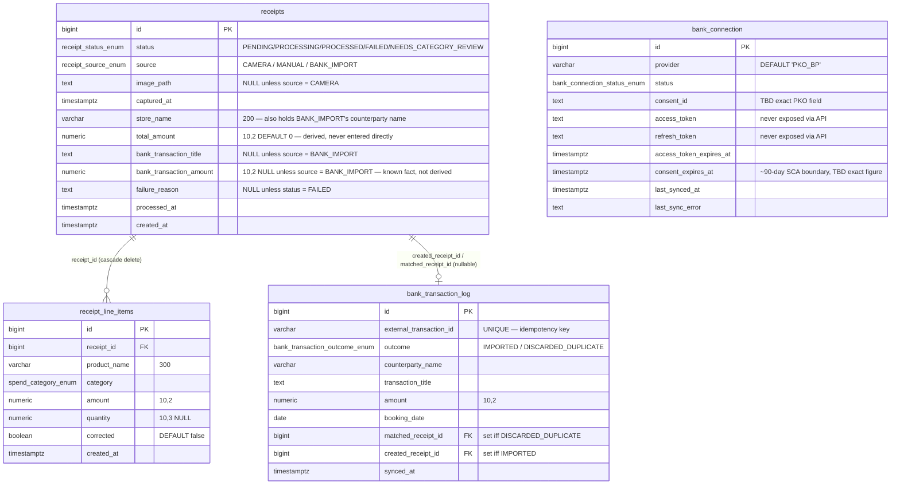
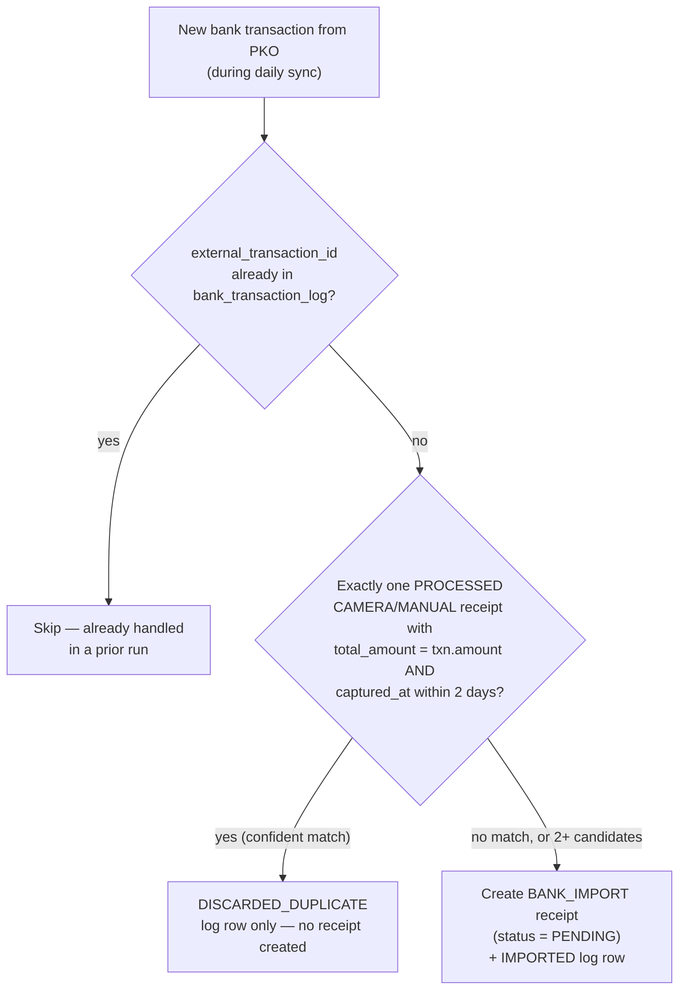
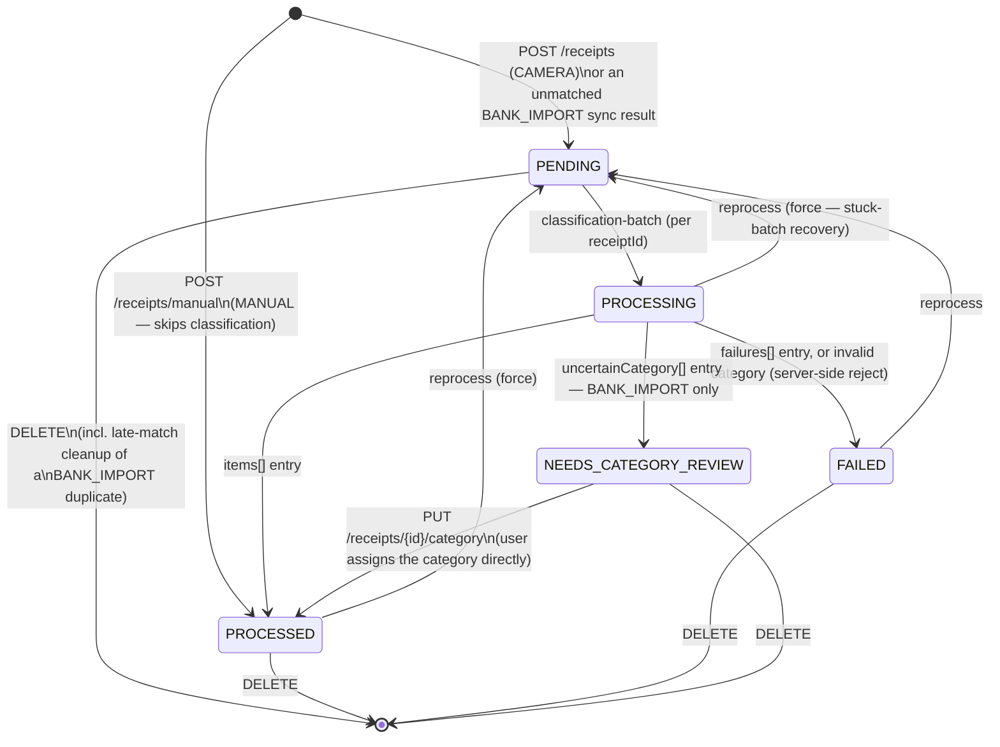
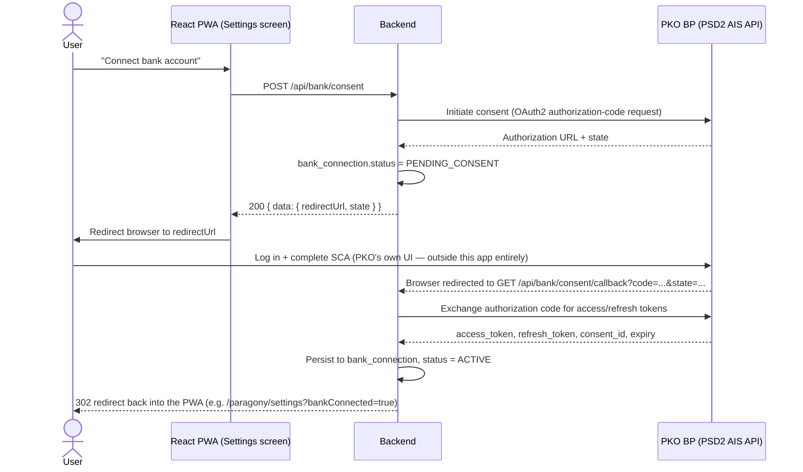
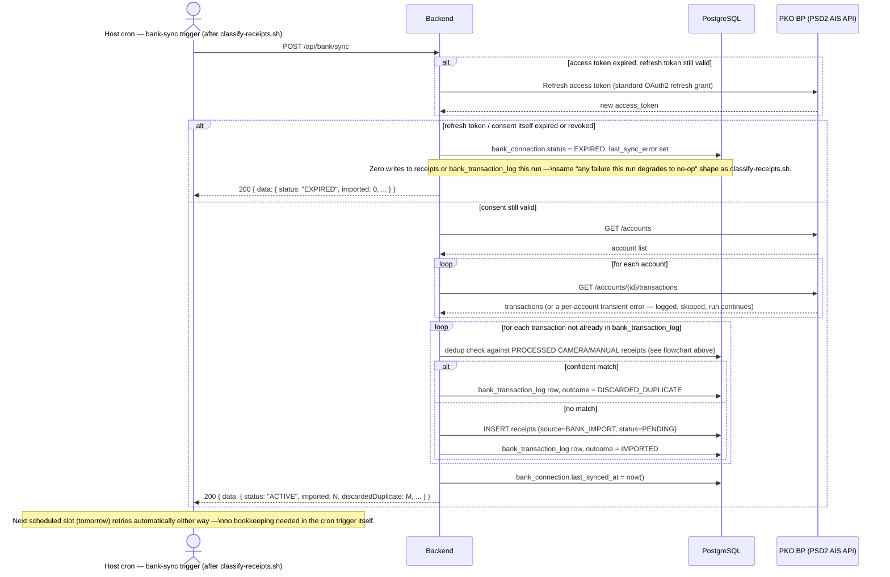

# 06 — PKO BP Bank-Transaction Integration

> **Audience:** All agents. This is the current, authoritative design for the second receipt
> source (`BANK_IMPORT`) — the reasoning behind it lives in `docs/adr/ADR-007-pko-bp-psd2-integration.md`;
> this document is what Backend/Frontend/DevOps build against.
>
> **Status:** design-only. Nothing described here is implemented yet — this is the shared
> contract for the follow-up Backend/Frontend/DevOps work (see "Follow-Up Work" at the bottom).
> The schema shapes below are illustrative SQL, not an executable Flyway migration; Backend owns
> writing the actual `V{n}__bank_import.sql` against this design.

---

## What This Adds

A second way a receipt enters the system, alongside a photographed `CAMERA` receipt or a
hand-typed `MANUAL` one: a **`BANK_IMPORT`** receipt, created automatically once a day from the
user's PKO Bank Polski transaction history via PSD2 account-information access (ADR-007).

Two things make `BANK_IMPORT` different from the other two sources:
- **No image, no per-line-item breakdown.** A bank transaction only ever gives a counterparty
  name, a free-text title, an amount, and a date — never a product-level itemization. Its
  classification is a **whole-transaction** category assignment (one line item), not the
  many-line-items-per-receipt shape `CAMERA`/`MANUAL` use.
- **It might not become a receipt at all.** If it confidently matches a photo the user already
  took of the same purchase, it's silently discarded — see "Dedup: Silent Discard" below.

---

## Domain Model Changes

### Enum changes

```sql
-- receipt_source_enum gains a third value
ALTER TYPE receipt_source_enum ADD VALUE 'BANK_IMPORT';

-- receipt_status_enum gains a fifth value, reachable only by BANK_IMPORT receipts
ALTER TYPE receipt_status_enum ADD VALUE 'NEEDS_CATEGORY_REVIEW';

CREATE TYPE bank_connection_status_enum AS ENUM (
    'DISCONNECTED', 'PENDING_CONSENT', 'ACTIVE', 'EXPIRED', 'ERROR'
);

CREATE TYPE bank_transaction_outcome_enum AS ENUM ('IMPORTED', 'DISCARDED_DUPLICATE');
```

### New columns on `receipts`

| Column | Type | Notes |
|---|---|---|
| `bank_transaction_title` | TEXT | Nullable. The bank's free-text transfer/purchase title. Only ever set for `BANK_IMPORT`; used as classifier input and as the eventual line item's `productName`. |
| `bank_transaction_amount` | NUMERIC(10,2) | The amount PKO reported for this transaction — a known fact from the moment of import, **not** the same field as `total_amount`. Required for `BANK_IMPORT`, null otherwise. |

Why a separate `bank_transaction_amount` rather than just setting `total_amount` directly at
import time: `total_amount`'s meaning everywhere else in this app is strictly "derived,
`SUM(receipt_line_items.amount)`, recomputed on every line-item write" (domain rule 1 in
`02-domain-model-and-schema.md`). A `BANK_IMPORT` receipt sits with **zero** line items while
`PENDING` or `NEEDS_CATEGORY_REVIEW` — exactly like a `CAMERA` receipt does — so `total_amount`
correctly stays `0` until classification (or manual category assignment) creates the one line
item that makes it non-zero. `bank_transaction_amount` is the separate, known-from-the-start fact
that lets the UI show "42.00 zł, awaiting category" during the review-queue window, and lets the
classifier echo a known amount back rather than inventing one.

Updated `CHECK` constraints (extending, not replacing, the ones already in `V1__init.sql`):

```sql
-- image_path: now excludes BANK_IMPORT too (was CAMERA vs MANUAL only)
ALTER TABLE receipts DROP CONSTRAINT receipts_image_path_matches_source;
ALTER TABLE receipts ADD CONSTRAINT receipts_image_path_matches_source CHECK (
    (source = 'CAMERA' AND image_path IS NOT NULL) OR
    (source IN ('MANUAL', 'BANK_IMPORT') AND image_path IS NULL)
);

ALTER TABLE receipts ADD CONSTRAINT receipts_bank_amount_matches_source CHECK (
    (source = 'BANK_IMPORT') = (bank_transaction_amount IS NOT NULL)
);

ALTER TABLE receipts ADD CONSTRAINT receipts_bank_title_only_for_bank_import CHECK (
    bank_transaction_title IS NULL OR source = 'BANK_IMPORT'
);

ALTER TABLE receipts ADD CONSTRAINT receipts_review_status_only_for_bank_import CHECK (
    status <> 'NEEDS_CATEGORY_REVIEW' OR source = 'BANK_IMPORT'
);
```

### New table: `bank_connection`

One row per connected provider (in practice, one row total — a single PKO connection). Tracks
OAuth2/consent state for ADR-007's graceful-degradation design.

```sql
CREATE TABLE bank_connection (
    id                        BIGSERIAL PRIMARY KEY,
    provider                  VARCHAR(50) NOT NULL DEFAULT 'PKO_BP',
    status                    bank_connection_status_enum NOT NULL DEFAULT 'DISCONNECTED',
    consent_id                TEXT NULL,          -- PSD2 consent identifier — exact field TBD
    access_token              TEXT NULL,          -- never exposed via API; encryption-at-rest recommended, see ADR-007
    refresh_token             TEXT NULL,          -- same
    access_token_expires_at   TIMESTAMPTZ NULL,
    consent_expires_at        TIMESTAMPTZ NULL,   -- ~90-day SCA re-auth boundary (RTS), exact PKO figure TBD
    last_synced_at            TIMESTAMPTZ NULL,
    last_sync_error           TEXT NULL,
    created_at                TIMESTAMPTZ NOT NULL DEFAULT NOW(),
    updated_at                TIMESTAMPTZ NOT NULL DEFAULT NOW()
);
```

### New table: `bank_transaction_log`

Every bank transaction the daily sync sees, imported or discarded — the idempotency key
(`external_transaction_id` is `UNIQUE`, so a transaction already logged is never re-evaluated on
a later run) **and** the audit trail ADR-007's "auditable/debuggable" requirement calls for,
without a dedicated review UI.

```sql
CREATE TABLE bank_transaction_log (
    id                       BIGSERIAL PRIMARY KEY,
    external_transaction_id  VARCHAR(128) NOT NULL UNIQUE,   -- PKO's own transaction id — TBD exact field name
    outcome                  bank_transaction_outcome_enum NOT NULL,
    counterparty_name        VARCHAR(200) NULL,
    transaction_title        TEXT NULL,
    amount                   NUMERIC(10,2) NOT NULL,
    booking_date              DATE NOT NULL,
    matched_receipt_id       BIGINT NULL REFERENCES receipts (id) ON DELETE SET NULL,
    created_receipt_id       BIGINT NULL REFERENCES receipts (id) ON DELETE SET NULL,
    synced_at                TIMESTAMPTZ NOT NULL DEFAULT NOW(),

    CONSTRAINT bank_transaction_log_outcome_matches_refs CHECK (
        (outcome = 'DISCARDED_DUPLICATE' AND matched_receipt_id IS NOT NULL AND created_receipt_id IS NULL) OR
        (outcome = 'IMPORTED' AND created_receipt_id IS NOT NULL AND matched_receipt_id IS NULL)
    )
);
```

`matched_receipt_id`/`created_receipt_id` use `ON DELETE SET NULL` rather than `CASCADE` —
deleting a receipt (the existing `DELETE /receipts/{id}`, or the retroactive-discard cleanup
below) must never silently delete audit history; the log row survives with a nulled reference.

A row's `outcome` can flip **once**, retroactively: `IMPORTED` → `DISCARDED_DUPLICATE`, when the
late-match cleanup (see below) discovers after the fact that an already-imported bank receipt
duplicates a photo classified later. This is the only mutation this table ever undergoes.

### Updated ER Diagram



`bank_connection` has no FK relationship to `receipts` — it's connection/auth state, not
transaction data — so it's omitted from the relationship lines above.

Note `store_name` is deliberately **reused** for `BANK_IMPORT`'s counterparty name rather than
adding a parallel column — both mean "who the money went to," and this app already treats
`storeName` as nullable-until-known on every source. Reusing it avoids two columns with
near-identical semantics (YAGNI).

---

## Dedup: Silent Discard, Not a Review Queue

Per ADR-007 §4, this is a **binary** decision per bank transaction: confidently matches an
existing photographed/manual receipt → discard silently (logged, not shown as a receipt);
otherwise → import as its own `BANK_IMPORT` receipt.



**Why "2+ candidates" also falls to no-match** rather than an ambiguous-review state: an
occasional missed dedup is visible (an extra receipt the user can delete via the existing
`DELETE /receipts/{id}`) and self-correcting; a wrong silent discard is invisible, permanent data
loss. When the heuristic can't be confident, err toward keeping the data, never toward hiding it.
This is a deliberate two-way decision, not the three-way match/no-match/ambiguous state machine
an earlier draft of this design considered — the user explicitly asked for the simpler shape.

### The Ordering Hazard, and Its Fix

Both the classify job and the bank sync run once daily. If a photo taken the same day its
matching transaction posts is still `PENDING` (unclassified, `total_amount` still `0`) at the
moment the sync job's dedup check runs, the match is missed and the transaction gets imported —
creating exactly the duplicate this feature exists to prevent.

Two mitigations, together:

1. **Cron ordering**: schedule `classify-receipts.sh` before the bank-sync trigger in the host
   crontab (DevOps, follow-up work) — e.g. classify at 06:00, bank-sync at 06:15 — so same-day
   photos are `PROCESSED` (a real `total_amount`) before the forward dedup check runs against
   them in the common case.
2. **A symmetric second trigger, for the reverse ordering**: whenever an itemized receipt
   (`CAMERA` or `MANUAL`) newly reaches `PROCESSED` — via `POST /receipts/classification-batch` or
   `POST /receipts/manual` — the *same* matching heuristic runs once more, this time checking the
   new receipt against existing, not-yet-discarded `BANK_IMPORT` receipts (any status —
   `PENDING`, `PROCESSED`, or `NEEDS_CATEGORY_REVIEW`). A late-discovered match:
   - `DELETE`s the standalone `BANK_IMPORT` receipt (same operation `DELETE /receipts/{id}`
     already performs),
   - flips its `bank_transaction_log` row from `IMPORTED` to `DISCARDED_DUPLICATE`
     (`created_receipt_id` cleared, `matched_receipt_id` set to the photo's id).

Both trigger points call the same match function (`findConfidentDuplicate(candidateReceipt)` —
Backend's naming) — one heuristic, two call sites, per DRY.

**Accepted consequence:** a monthly total can visibly move after the fact when a late photo
retroactively removes an already-counted bank-import receipt. This is correct behavior (avoiding
a double count matters more than a number never moving once shown) and expected for a personal
app at this scale.

---

## Classification: Whole-Transaction, No Image

A `BANK_IMPORT` receipt is created `PENDING` (unless silently discarded — see above), with **zero
line items**, `total_amount = 0`, `bank_transaction_title` and `bank_transaction_amount` already
known from the sync. It re-enters the *existing* daily classification pipeline
(`docs/architecture/04-classification-flow.md`) alongside `CAMERA` receipts — reusing the one
batched `claude -p` invocation rather than a second, separate call (keeps ADR-002's cost
reasoning intact: still exactly one invocation per day).

### `GET /receipts/pending` carries the transaction inline — there's no image to fetch

For a `CAMERA` id, the wrapper script still downloads the photo via `GET /receipts/{id}/image`
before building the prompt manifest. A `BANK_IMPORT` id has no image endpoint to call — instead
`GET /receipts/pending`'s response includes everything Claude needs **inline**:

```json
{
  "data": [
    { "id": 42, "source": "CAMERA" },
    {
      "id": 57, "source": "BANK_IMPORT",
      "counterpartyName": "Żabka Polska", "transactionTitle": "ZAKUP PRZY UZYCIU KARTY",
      "amount": 23.40, "capturedAt": "2026-08-30"
    }
  ],
  "meta": { "...": "..." }
}
```

See `docs/openapi.yaml`'s updated `PendingReceiptRef` schema.

### Three-way classification outcome (was two-way)

`classify-receipts.sh`'s manifest stays one line per pending id, appended after `prompt.md`'s
static template (unchanged mechanism) — a `CAMERA` line still carries a local image `path=`
(unchanged), a `BANK_IMPORT` line instead carries its transaction facts inline
(`counterparty=`/`title=`/`amount=`/`date=`, new). Claude tells the two apart by which fields are
present on each line, not by a section heading — see `infra/classify/prompt.md`, which is written
to stay backward-compatible with a manifest that has no bank-transaction lines at all (today's
reality until the sync job is built) so this pass doesn't regress the currently-running photo
classification. Claude's JSON reply gains a third array:

```json
{
  "items": [ { "receiptId": 42, "storeName": "Lidl", "lineItems": [ "...many, per photo..." ] },
             { "receiptId": 57, "storeName": "Żabka Polska", "capturedAt": "2026-08-30",
               "lineItems": [ { "productName": "ZAKUP PRZY UZYCIU KARTY", "category": "JEDZENIE_SREDNIE", "amount": 23.40 } ] } ],
  "uncertainCategory": [ { "receiptId": 61, "reason": "transaction title too generic to infer a category" } ],
  "failures": [ { "receiptId": 43, "reason": "photo too blurry to read any line items" } ]
}
```

Rules (see `docs/openapi.yaml`'s `ClassificationBatchRequest` and `infra/classify/prompt.md`):
- A `CAMERA` id must appear in exactly one of `items`/`failures` — **never** `uncertainCategory`;
  the existing "always guess, a human corrects later" policy for photo line items is unchanged.
- A `BANK_IMPORT` id must appear in exactly one of `items` (confident — exactly one `lineItems`
  entry, echoing `bank_transaction_amount` back unchanged), `uncertainCategory` (not confident —
  no category forced), or `failures` (genuinely corrupt/empty transaction data — expected to be
  rare).
- An `uncertainCategory[]` entry naming a non-`BANK_IMPORT` receipt is invalid input from the
  classifier — tolerated the same way an unknown `receiptId` already is (skipped, reported, never
  aborts the batch).

`POST /receipts/classification-batch` transitions: `items[]` → `PROCESSED` (unchanged),
`failures[]` → `FAILED` (unchanged), `uncertainCategory[]` → **`NEEDS_CATEGORY_REVIEW`** (new) —
no line item created, `total_amount` stays `0`, `bank_transaction_amount` remains the only known
figure until resolved.

### Resolving `NEEDS_CATEGORY_REVIEW`

`PUT /receipts/{id}/category` (new endpoint) — the user picks one of the 11 fixed categories
directly. Creates exactly one line item (`productName` = `bankTransactionTitle` if present else
`storeName`, `category` = given, `amount` = `bankTransactionAmount`, `corrected = true`
immediately — it's first-party human input, same protection a hand-correction gets), recomputes
`total_amount`, transitions `NEEDS_CATEGORY_REVIEW → PROCESSED`, stamps `processed_at`.

**Not resolvable via `reprocess`** — re-running Claude against the same fixed transaction text
would reach the same "not confident" conclusion again, so `reprocess`'s valid from-states stay
exactly `FAILED`/`PROCESSED`/`PROCESSING` as before; `NEEDS_CATEGORY_REVIEW`'s only exit is direct
human category assignment.

### Updated Receipt Status Lifecycle



`03-receipt-lifecycle.md`'s existing diagram and table remain correct for `CAMERA`/`MANUAL`
receipts unchanged; this is the superset that also covers `BANK_IMPORT`.

---

## Consent Flow



## Daily Sync — Happy Path and Graceful Degradation on Expired Consent



Recovery from `EXPIRED` is **only** through the user re-initiating consent from the PWA settings
screen (the Consent Flow diagram above) — there is no automatic path, because SCA cannot be
automated. Every subsequent daily run stays a cheap, harmless no-op (same `EXPIRED` short-circuit)
until that happens.

---

## Pattern & Principle Evaluation (additions to `02-domain-model-and-schema.md`'s table)

| Candidate | Verdict | Why |
|---|---|---|
| Ports & Adapters (Hexagonal) for `BankAccountInformationPort` | **adopted** | The real PKO wire format is unknown today (sandbox spec not yet registered) and may later be swapped for a licensed aggregator (ADR-007 §2) — the port insulates sync-job/domain logic from both unknowns, containing either change to one adapter class. |
| Gateway (PoEAA) — `PkoBpPsd2Adapter` | **adopted** | Standard shape for "one class owns all wire-format translation to/from one external system"; same role investing-app's own market-data gateways play. |
| Idempotent Receiver (EIP) — `bank_transaction_log.external_transaction_id` UNIQUE | **adopted** | `POST /bank/sync` must tolerate re-fetching overlapping date ranges (and running twice in a day) without re-evaluating or re-importing a transaction it already logged — same shape as `classification-batch`'s existing idempotent-per-receipt handling. |
| Shared matching heuristic, called from two trigger points (sync-time and classification-time) | **adopted (DRY)** | Needed at both trigger points to close the ordering hazard (see above) — one function, two call sites, rather than duplicating the date/amount comparison logic. |
| Resilience4j / circuit breaker for PKO calls | **rejected** | Once-daily run, no concurrent callers to protect from cascading retries — "log, write nothing, let the next scheduled run try again" already gets the same effect (see ADR-002's identical reasoning for the classify job), at zero added dependency. |
| Three-way match/no-match/ambiguous-match state machine | **rejected** | An earlier draft considered a `NEEDS_REVIEW` match state with a dedicated confirm/reject UI. Superseded — the user explicitly asked for a binary confident-match-or-no-match decision with a silent discard, not a review screen (ADR-007 §4). |
| `NEEDS_CATEGORY_REVIEW` as a boolean flag on `PROCESSED` | **rejected** | `PROCESSED` means "has valid line items and a trustworthy `total_amount`" everywhere this app already reads it (list filters, spend aggregates, the dedup heuristic itself) — a flag would create a `PROCESSED`-but-incomplete hybrid that breaks that invariant for every existing consumer. A dedicated status is the smaller, more consistent change. |
| Spring `@Scheduled` for the daily bank-sync trigger | **rejected** | This app already established "the host crontab drives all timing; the backend/CLI only exposes trigger endpoints" for the classify job. Splitting timing across two mechanisms (host cron for classify, in-JVM scheduler for bank-sync) adds a second config surface for no benefit, and a container restart would silently drop a due `@Scheduled` run with none of the host crontab's own logging. |
| CRUD/multi-bank abstraction for `bank_connection` | **rejected** | Exactly one bank (PKO BP) is in scope. A `provider` column is kept for clarity, not to enable a multi-bank UI that doesn't exist and isn't asked for — YAGNI. |

---

## API Surface Summary

See `docs/openapi.yaml` for the full contract. New/changed operations:

| Method | Path | Notes |
|---|---|---|
| POST | `/api/bank/consent` | Initiate PSD2 consent — returns a redirect URL for the PWA to navigate to. |
| GET | `/api/bank/consent/callback` | OAuth2 redirect target (browser-navigated by PKO, not called by the PWA's JS) — exchanges the auth code, persists tokens, redirects back into the PWA. |
| GET | `/api/bank/connection` | Connection status for the settings screen — never returns raw tokens. |
| DELETE | `/api/bank/connection` | Disconnect / clear stored tokens locally. |
| POST | `/api/bank/sync` | **New sync-job entry point**, mirrors `classification-batch`'s shape — fetch, dedup, import; always `200`, degrades to a no-op on expired consent. |
| PUT | `/api/receipts/{id}/category` | Resolve a `NEEDS_CATEGORY_REVIEW` receipt by hand. |
| GET | `/api/receipts` | Gains an optional `source` filter (`CAMERA`/`MANUAL`/`BANK_IMPORT`). |
| GET | `/api/receipts/pending` | Response extended — inline transaction fields for `BANK_IMPORT` entries (no image to fetch). |
| POST | `/api/receipts/classification-batch` | Request gains `uncertainCategory[]`; response gains `needsCategoryReview[]`. |

---

## Follow-Up Work (flagged for other agents — not performed here)

- **Backend**: write the real Flyway migration against the schema sketched above; implement
  `BankAccountInformationPort` + a stub/sandbox `PkoBpPsd2Adapter`; implement `/api/bank/*` and
  `PUT /receipts/{id}/category`; implement the dedup heuristic as one shared function called from
  both the sync job and the classification-batch/manual-creation code paths; ensure **every**
  spend-aggregate query (`/spending/summary`, `/spending/trend`, and any future one) only
  considers receipts that were never discarded — a `BANK_IMPORT` receipt confidently matched to a
  photo is `DELETE`d outright (not soft-flagged), so no extra query filter is actually needed
  there, but this is worth a Backend-side test asserting it explicitly. Testcontainers coverage
  for the ordering-hazard scenario (bank transaction arrives before vs. after its matching photo
  is classified) is specifically called out as worth its own test, given how easy that race is to
  get subtly wrong.
- **Frontend**: a Settings/Connect screen driving the consent flow (`POST /bank/consent` →
  redirect → land back from the callback's redirect); a `source` badge or filter in the receipt
  list/detail views; a **new "needs a category" review panel/section** (not just a badge on the
  existing list — the user was explicit about this) listing `NEEDS_CATEGORY_REVIEW` receipts
  (`GET /receipts?status=NEEDS_CATEGORY_REVIEW`) with a category picker calling
  `PUT /receipts/{id}/category`.
- **DevOps**: a `bank-sync` host-cron entry calling `POST /api/bank/sync`, scheduled **after**
  `classify-receipts.sh` in the daily crontab (see the ordering-hazard note above) — nothing here
  is deployable against real PKO data until the user has sandbox (later, production) credentials,
  so this stays design/stub until then, same as the task brief's own scoping.
- **`infra/classify/prompt.md`**: updated directly by this pass — the field-based photo-vs-bank-
  transaction manifest-line convention and the three-way output contract are now part of the
  static prompt template, and are written to be backward-compatible with today's photo-only
  manifest (no script change required for the existing job to keep working). DevOps's actual
  script change is just appending `counterparty=`/`title=`/`amount=`/`date=` lines for
  `BANK_IMPORT` pending entries once `POST /bank/sync` exists — no further prompt-content work is
  expected here unless the category rules themselves change, which is CLAUDE.md's job to drive,
  not this integration's.
